---
html:
  embed_local_images: false
  embed_svg: true
  offline: false
  toc: false

print_background: false
---
[toc]
# Bit-Database

## 项目介绍
### 环境配置
* Python 3.8.5
* 前端采用 jquery + bootstrap 
* 后端采用 Django+flask
* 数据库采用 postgresql,远程数据库采用华为高斯云数据库
* 数据库交互采用ORM框架 SQLAlchemy

### 设计模式
* MVC模式
* 使用api分离后端接口
* 使用jwt做用户认证
* 在使用api传输数据的同时，对一些数据变动小的页面采用render_template的模板渲染函数进行数据传输
* 前端使用jinja2渲染模板,这样减少接口的请求次数，提高效率

### 数据库结构
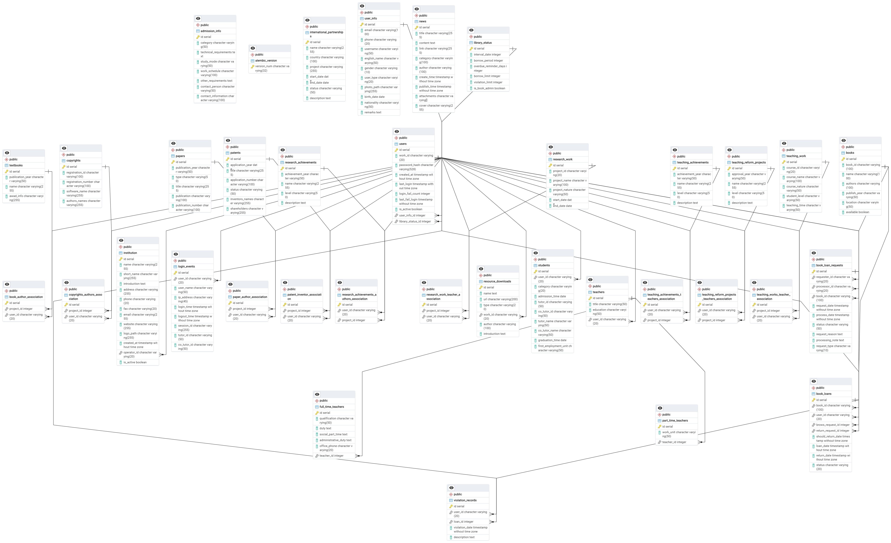

### 数据库安全设计
* 使用jwt做用户认证
* 使用flask-jwt-extended实现jwt认证
* 数据库连接池采用sqlalchemy-pooling
* 前端api端口访问时进行权限认证
* 数据库内设置不同权限用户，根据前端的操作，数据库使用不同的权限用户进行反应
* 双层权限控制，避免提权漏洞

### 数据库备份，恢复与迁移
* 使用pg_dump和pg_restore进行数据库备份和恢复
* 使用alembic进行数据库迁移
* 数据库迁移时请确保表结构更改正确

## 运行本项目
* 克隆本项目到本地
```
git clone https://github.com/yang-kun-long/Bit-Database.git
```
* 安装依赖包
```
pip install -r requirements.txt
```
* 配置数据库连接信息
  * 打开 `Bit-Database/BitDatabase/database.yaml` 文件，修改 `DATABASES` 字典中的数据库连接信息。
  * 可以是本地数据库，也可以是远程数据库，如华为云数据库。
* 运行项目
  * 运行后端项目：
  ```
  python app.py
  ```
  * 运行前端项目：
  * 在浏览器输入 `http://127.0.0.1:5000` 。
  

## 表结构

### Institution 模型

#### 描述

`Institution` 模型代表研究所的详细信息，包括名称、简介、联系方式等。

#### 字段说明

| 字段名       | 数据类型    | 描述                 | 是否可为空 | 默认值     | 关联模型 |
| ------------ | ----------- | -------------------- | ---------- | ---------- | -------- |
| id           | Integer     | 研究所 ID，主键      | 否         | 自增       |          |
| name         | String(255) | 研究所名称           | 否         |            |          |
| short_name   | String(255) | 研究所简称           | 否         |            |          |
| introduction | Text        | 研究所简介           | 否         |            |          |
| address      | String(255) | 研究所地址           | 否         |            |          |
| phone        | String(20)  | 研究所电话           | 否         |            |          |
| fax          | String(20)  | 研究所传真           | 否         |            |          |
| email        | String(255) | 研究所邮箱           | 否         |            |          |
| website      | String(255) | 研究所网站           | 否         |            |          |
| logo_path    | String(255) | 研究所 logo 路径     | 否         |            |          |
| created_at   | DateTime    | 创建时间             | 是         | 当前时间戳 |          |
| is_active    | Boolean     | 是否启用             | 是         | False      |          |
| operator_id  | String(20)  | 更新人 ID，外键      | 否         |            | Users    |
| operator     | Object      | 更新人对象，反向引用 | 是         |            | Users    |

#### 反向引用

- `operator`: 通过 `Users` 模型关联更新人的详细信息。

#### 默认值

- 新建研究所记录时，`is_active` 默认为 `False`，表示未启用。
- `created_at` 默认为当前时间戳。

#### 外键关系

- `operator_id` 字段作为外键与 `Users` 表的 `work_id` 字段关联。

### Users 模型

#### 描述

`Users` 模型代表系统中的用户账户，包含用户的认证信息和个人资料的外键。

#### 字段说明

| 字段名            | 数据类型    | 描述                         | 是否可为空 | 默认值     | 关联模型      |
| ----------------- | ----------- | ---------------------------- | ---------- | ---------- | ------------- |
| id                | Integer     | 用户 ID，主键                | 否         | 自增       |               |
| work_id           | String(20)  | 工号                         | 否         |            |               |
| password_hash     | String(528) | 密码哈希                     | 否         |            |               |
| created_at        | DateTime    | 创建时间                     | 是         | 当前时间戳 |               |
| last_login        | DateTime    | 最后登录时间                 | 是         | None       |               |
| login_fail_count  | Integer     | 登录失败次数                 | 是         | 0          |               |
| last_fail_login   | DateTime    | 上次登录失败时间             | 是         | None       |               |
| is_active         | Boolean     | 是否激活                     | 是         | False      |               |
| user_info_id      | Integer     | 用户信息 ID，外键            | 否         |            | UserInfo      |
| user_info         | Object      | 用户信息对象，反向引用       | 是         |            | UserInfo      |
| library_status_id | Integer     | 图书馆常量设置 ID，外键      | 否         |            | LibraryStatus |
| library_status    | Object      | 图书馆常量设置对象，反向引用 | 是         |            | LibraryStatus |

#### 方法说明

- `get_english_name(self)`: 返回用户信息中的英文名字段。
- `get_teacher(self, zheng, type)`: 根据提供的 `zheng` 和 `type` 参数，返回学生的导师或共同导师的名称或 ID。
- `@property username`: 返回用户信息中的用户名字段。
- `set_password(self, password)`: 设置用户的密码，通过哈希处理。
- `check_password(self, password)`: 检查提供的密码是否与用户的哈希密码匹配。
- `get_id(self)`: 返回用户 ID 的字符串表示。
- `activate(self)`: 激活用户账户。
- `reset_password(self, new_password)`: 重置用户密码为提供的新密码。
- `update_info(self, **kwargs)`: 根据提供的关键字参数更新用户信息。
- `to_dict(self)`: 返回用户的字典表示，不包括 `user_info` 和 `library_status` 字段。

#### 反向引用

- `user_info`: 通过 `UserInfo` 模型关联用户详细信息。
- `library_status`: 通过 `LibraryStatus` 模型关联图书馆状态信息。

#### 默认值

- 新建用户时，`is_active` 默认为 `False`，表示未激活。
- `last_login` 默认为 `None`。
- `login_fail_count` 默认为 `0`。
- `password_hash` 默认为哈希处理后的 `'123456'`。

### UserInfo 模型

#### 描述

`UserInfo` 模型存储用户详细信息，包括用户名、联系方式、性别、用户类型等。

#### 字段说明

| 字段名       | 数据类型    | 描述              | 是否可为空 | 默认值                           | 备注         |
| ------------ | ----------- | ----------------- | ---------- | -------------------------------- | ------------ |
| id           | Integer     | 用户信息 ID，主键 | 否         | 自增                             |              |
| email        | String(100) | 邮箱              | 是         |                                  |              |
| phone        | String(20)  | 手机号            | 是         |                                  |              |
| username     | String(50)  | 用户名            | 否         |                                  |              |
| english_name | String(50)  | 英文姓名          | 是         | 拼音转换自`username`（若未提供） |              |
| gender       | String(10)  | 性别              | 是         |                                  |              |
| user_type    | String(20)  | 用户类型          | 否         |                                  |              |
| photo_path   | String(255) | 照片路径          | 是         | "images/avatar.png"              | 默认头像路径 |
| birth_date   | Date        | 出生日期          | 是         |                                  |              |
| nationality  | String(50)  | 国籍              | 是         |                                  |              |
| remarks      | Text        | 备注信息          | 是         |                                  |              |

#### 方法说明

- `__init__(self, user_id, username, phone, user_type, gender, email=None, nationality=None, birth_date=None, english_name=None, remarks=None, photo_path="images/avatar.png")`: 构造函数，初始化用户信息。若未提供邮箱，则以`user_id`加"@bit.edu.cn"作为默认邮箱；若未提供英文姓名，则使用中文姓名的拼音。
- `to_dict(self)`: 返回用户的字典表示。

#### 默认值

- `photo_path` 默认为 "images/avatar.png"，表示默认头像路径。
- 邮箱默认为 `user_id` 加 "@bit.edu.cn"，如果提供了邮箱则使用提供的邮箱。

#### 备注

- 英文姓名如果没有提供，则自动使用中文姓名的拼音作为英文姓名。

#### 图书馆常量设置表：（LibraryStatus）

- id: 图书馆常量设置 ID，主键
- user_id: 用户 ID，外键关联 Users 表
- interval_date: 间隔日期 天数 默认 5
- borrow_period: 借阅期限 天数 默认 30
- overdue_reminder_days: 超出期限提前提醒天数 默认 3
- borrow_limit: 单个用户借阅数量限制 默认 2
- violation_limit: 单个用户违规记录数量限制 默认 3
- is_book_admin: 是否图书管理员

### Students 模型

#### 描述

`Students` 模型代表学生信息，包括学生类别、入学时间、导师信息等，与`Users`模型通过`user_id`关联。

#### 字段说明

| 字段名                | 数据类型   | 描述                         | 是否可为空 | 默认值 |
| --------------------- | ---------- | ---------------------------- | ---------- | ------ |
| id                    | Integer    | 学生 ID，主键                | 否         | 自增   |
| user_id               | String(20) | 关联的用户 ID，外键          | 否         |        |
| category              | String(20) | 学生类别（本科、硕士、博士） | 否         |        |
| admission_time        | Date       | 入学时间                     | 否         |        |
| user                  | Object     | 关联的用户对象，反向引用     | 是         |        |
| tutor_id              | String(50) | 导师 ID                      | 是         |        |
| co_tutor_id           | String(50) | 副导师 ID                    | 是         |        |
| tutor_name            | String(50) | 导师姓名                     | 是         |        |
| co_tutor_name         | String(50) | 副导师姓名                   | 是         |        |
| graduation_time       | Date       | 毕业时间                     | 是         |        |
| first_employment_unit | String(50) | 初次就业单位                 | 是         |        |

#### 构造函数说明

- `__init__(self, student_id, category, admission_time, username, phone, gender, user_type, tutor_id=None, co_tutor_id=None, tutor_name=None, co_tutor_name=None, graduation_time=None, first_employment_unit=None, email=None, nationality=None, birth_date=None, remarks=None, english_name=None)`: 初始化学生信息。如果未提供`tutor_id`或`co_tutor_id`，则字段设置为`None`。同时创建关联的`Users`记录。

#### 反向引用

- `user`: 通过`Users`模型关联用户信息。

#### 默认值

- 无特定字段默认值，但`tutor_id`、`co_tutor_id`、`tutor_name`、`co_tutor_name`、`graduation_time`和`first_employment_unit`在未提供时将被设置为`None`。

#### 外键关系

- `user_id`字段作为外键与`Users`表的`work_id`字段关联。

### Teachers 模型

#### 描述

`Teachers` 模型代表教师信息，包括职称、学历等，与`Users`模型通过`user_id`唯一关联。

#### 字段说明

| 字段名    | 数据类型   | 描述                | 是否可为空 | 默认值 |
| --------- | ---------- | ------------------- | ---------- | ------ |
| id        | Integer    | 教师 ID，主键       | 否         | 自增   |
| title     | String(50) | 职称                | 是         |        |
| education | String(50) | 教师学历            | 是         |        |
| user_id   | String(20) | 关联的用户 ID，外键 | 否         |        |
| user      | Object     | 关联的用户对象      | 是         |        |

#### 构造函数说明

- `__init__(self, title, teacher_id, username, phone, gender, user_type, education, email=None, nationality=None, birth_date=None, english_name=None, remarks=None)`: 初始化教师记录，包括职称、学历等信息，并创建一个与之关联的`Users`对象。

#### 反向引用

- `user`: 通过`Users`模型关联用户详细信息。

#### 默认值

- 无特定字段默认值，但`title`与`education`在未提供时将被设置为`None`。

#### 外键关系

- `user_id`字段作为外键与`Users`表的`work_id`字段关联，并具有唯一性约束。

#### 唯一性约束

- `user_id`: 必须唯一，确保每个教师的用户 ID 在数据库中只存在一次。

### PartTimeTeachers 模型

#### 描述

`PartTimeTeachers` 模型代表兼职教师的详细信息，与`Teachers`模型通过`teacher_id`一对一关联。

#### 字段说明

| 字段名     | 数据类型   | 描述              | 是否可为空 | 默认值 |
| ---------- | ---------- | ----------------- | ---------- | ------ |
| id         | Integer    | 兼职教师 ID，主键 | 否         | 自增   |
| work_unit  | String(50) | 工作单位          | 是         |        |
| teacher_id | Integer    | 教师工号，外键    | 否         |        |
| teacher    | Object     | 关联的教师实体    | 是         |        |

#### 构造函数说明

- `__init__(self, work_unit, teacher_id, title, username, phone, gender, education, email=None, nationality=None, birth_date=None, english_name=None, remarks=None)`: 初始化兼职教师记录，包括工作单位等信息，并创建一个与之关联的`Teachers`对象。

#### 反向引用

- `teacher`: 通过`Teachers`模型关联教师详细信息。

#### 默认值

- 无特定字段默认值，但`work_unit`在未提供时将被设置为`None`。

#### 外键关系

- `teacher_id`字段作为外键与`Teachers`表的`id`字段关联。

#### 示例构造函数调用

创建一个兼职教师记录时，您需要提供工作单位、教师工号、职称、用户名、手机号、性别、学历等信息，其他字段如邮箱、国籍、出生日期、英文姓名和备注信息是可选的。兼职教师的用户类型默认设置为'兼职教师'。

### FullTimeTeachers 模型

#### 描述

`FullTimeTeachers` 模型代表全职教师的详细信息，与`Teachers`模型通过`teacher_id`一对一关联。

#### 字段说明

| 字段名              | 数据类型   | 描述              | 是否可为空 | 默认值 |
| ------------------- | ---------- | ----------------- | ---------- | ------ |
| id                  | Integer    | 全职教师 ID，主键 | 否         | 自增   |
| qualification       | String(50) | 导师资格          | 是         |        |
| duty                | Text       | 研究所职务        | 是         |        |
| social_part_time    | Text       | 社会兼职          | 是         |        |
| administrative_duty | Text       | 学院行政职务      | 是         |        |
| office_phone        | String(20) | 办公电话          | 是         |        |
| teacher_id          | Integer    | 教师工号，外键    | 否         |        |
| teacher             | Object     | 关联的教师实体    | 是         |        |

#### 构造函数说明

- `__init__(self, teacher_id, title, qualification, duty, social_part_time, administrative_duty, office_phone, username, phone, gender, education, email=None, nationality=None, birth_date=None, english_name=None, remarks=None)`: 初始化全职教师记录，包括导师资格、研究所职务等信息，并创建一个与之关联的`Teachers`对象。

#### 反向引用

- `teacher`: 通过`Teachers`模型关联教师详细信息。

#### 默认值

- `office_phone`: 如果未提供，则默认为空字符串。

#### 外键关系

- `teacher_id`字段作为外键与`Teachers`表的`id`字段关联。

#### 用户类型

- 教师的用户类型默认设置为'全职教师'。

### LoginEvent 模型

#### 描述

`LoginEvent` 模型用于记录用户登录系统的相关事件信息。

#### 字段说明

| 字段名      | 数据类型    | 描述                          | 是否可为空 | 默认值                      |
| ----------- | ----------- | ----------------------------- | ---------- | --------------------------- |
| id          | Integer     | 登录事件 ID，主键             | 否         | 自增                        |
| user_id     | String(20)  | 用户工号，外键关联到 Users 表 | 是         |                             |
| user_name   | String(50)  | 用户名称                      | 是         |                             |
| ip_address  | String(45)  | 登录 IP 地址                  | 是         |                             |
| login_time  | DateTime    | 登录时间                      | 是         | 当前时间戳 (`datetime.now`) |
| logout_time | DateTime    | 登出时间，用户会话结束时间    | 是         |                             |
| session_id  | String(255) | 会话 ID，用于跟踪用户会话     | 是         |                             |
| tutor_id    | String(50)  | 导师 ID，如果用户是导师       | 是         |                             |
| co_tutor_id | String(50)  | 副导师 ID，如果用户是副导师   | 是         |                             |

#### 反向引用

- `user`: 通过`Users`模型关联用户详细信息，允许从登录事件查询到用户信息。

#### 默认值

- `login_time`: 默认设置为事件发生时的时间戳。

#### 外键关系

- `user_id`: 与`Users`表的`work_id`字段相关联，标识登录的用户。

#### 可空字段说明

- `logout_time`: 对于仍在进行中的会话，该字段可能为`NULL`。
- `tutor_id`和`co_tutor_id`: 如果用户不是导师或副导师，这些字段可能为`NULL`。

### TeachingWorksTeacherAssociation 模型

#### 描述

`TeachingWorksTeacherAssociation` 模型用于关联教学作品与教师，确保每个项目与参与的教师之间有明确的联系。

#### 字段说明

| 字段名     | 数据类型   | 描述                          | 是否可为空 |
| ---------- | ---------- | ----------------------------- | ---------- |
| id         | Integer    | 关联记录 ID，主键             | 否         |
| project_id | Integer    | 教学作品 ID，外键             | 否         |
| user_id    | String(20) | 用户工号，外键关联到 Users 表 | 否         |

#### 外键关系

- `project_id`: 与`TeachingWork`表的`id`字段相关联，标识教学作品。
- `user_id`: 与`Users`表的`work_id`字段相关联，标识参与教学作品的教师。

#### 模型功能

- 该模型允许将特定的教学作品与教师的工作编号相关联，确保教学责任和成果的归属明确。

#### 约束条件

- `project_id`和`user_id`字段由于是外键，因此不能包含空值，确保每条记录都有明确的教学作品和教师关联。

### TeachingWork 模型

#### 描述

`TeachingWork` 模型代表教学作品的详细信息，包括课程编号、名称、性质、学生层次和授课时间。

#### 字段说明

| 字段名        | 数据类型    | 描述          | 是否可为空 |
| ------------- | ----------- | ------------- | ---------- |
| id            | Integer     | 课程 ID，主键 | 否         |
| course_id     | String(20)  | 课程编号      | 否         |
| course_name   | String(100) | 课程名称      | 否         |
| course_nature | String(50)  | 课程性质      | 否         |
| student_level | String(50)  | 学生层次      | 否         |
| teaching_time | String(50)  | 授课时间      | 否         |

#### 关联模型

- `owner`: 定义了与`Users`模型的多对多关系，通过`TeachingWorksTeacherAssociation`表进行关联。

#### 构造函数说明

- `__init__(self, course_id, course_name, course_nature, student_level, teaching_time)`: 构造函数用于初始化一个新的`TeachingWork`实例，需要提供课程编号、名称、性质、学生层次和授课时间。

#### 多对多关系

- 教学作品与教师之间存在多对多关系，即一个教学作品可以有多个教师参与，一个教师也可以参与多个教学作品。

#### 默认值

- 无默认值，所有字段在创建记录时都需要明确指定。

#### 索引建议

- `course_id`: 作为课程编号，建议设置为唯一且可索引，以优化查询效率。

### ResearchWorkTeacherAssociation 模型

#### 描述

`ResearchWorkTeacherAssociation` 模型用于建立科研项目与教师之间的关联关系，支持多对多的关联方式。

#### 字段说明

| 字段名     | 数据类型   | 描述                          | 是否可为空 |
| ---------- | ---------- | ----------------------------- | ---------- |
| id         | Integer    | 关联记录 ID，主键             | 否         |
| project_id | Integer    | 科研项目 ID，外键             | 否         |
| user_id    | String(20) | 用户工号，外键关联到 Users 表 | 否         |

#### 外键关系

- `project_id`: 与`ResearchWork`表的`id`字段相关联，标识科研项目。
- `user_id`: 与`Users`表的`work_id`字段相关联，标识参与科研项目的教师。

#### 模型功能

- 该模型允许将特定的科研项目与教师的工作编号相关联，明确科研项目的参与人员。

#### 约束条件

- `project_id`和`user_id`字段由于是外键，因此不能包含空值，确保每条记录都有明确的科研项目和教师关联。

### ResearchWork 模型

#### 描述

`ResearchWork` 模型存储科研工作的详细信息，包括项目编号、名称、性质、开始和结束日期。

#### 字段说明

| 字段名         | 数据类型    | 描述              | 是否可为空 |
| -------------- | ----------- | ----------------- | ---------- |
| id             | Integer     | 科研工作 ID，主键 | 否         |
| project_id     | String(20)  | 项目编号          | 否         |
| project_name   | String(100) | 项目名称          | 否         |
| project_nature | String(50)  | 项目性质          | 否         |
| start_date     | Date        | 项目开始日期      | 是         |
| end_date       | Date        | 项目结束日期      | 是         |

#### 关联模型

- `owner`: 定义了与`Users`模型的多对多关系，通过`ResearchWorkTeacherAssociation`表进行关联。

#### 构造函数说明

- `__init__(self, project_id, project_name, project_nature, start_date, end_date)`: 构造函数用于初始化一个新的`ResearchWork`实例，需要提供项目编号、名称、性质、开始和结束日期。

#### 多对多关系

- 科研工作与教师之间存在多对多关系，即一个科研工作可以有多个教师参与，一个教师也可以参与多个科研工作。

#### 默认值

- `start_date`和`end_date`字段可以为空，允许记录尚未开始或持续进行中的项目。

#### 索引建议

- `project_id`: 作为项目编号，建议设置为唯一且可索引，以优化查询效率。

#### 描述

研究工作表用于存储科研工作的详细信息，包括项目编号、项目名称、项目性质、项目开始和结束日期。此外，通过多对多关系表`ResearchWorkTeacherAssociation`与用户表关联，以表示哪些教师参与了哪些科研工作。

#### 字段说明

| 字段名             | 数据类型    | 描述              | 是否可为空 | 默认值 | 关联模型 |
| ------------------ | ----------- | ----------------- | ---------- | ------ | -------- |
| **id**             | Integer     | 科研工作 ID，主键 | 否         | 自增   |          |
| **project_id**     | String(20)  | 项目编号          | 否         | None   |          |
| **project_name**   | String(100) | 项目名称          | 否         | None   |          |
| **project_nature** | String(50)  | 项目性质          | 否         | None   |          |
| **start_date**     | Date        | 项目开始日期      | 是         | None   |          |
| **end_date**       | Date        | 项目结束日期      | 是         | None   |          |

#### 多对多关系

- `owner`: 通过`ResearchWorkTeacherAssociation`表与`Users`表建立多对多关系，表示科研工作和教师之间的关联。

#### 初始化方法

- `__init__(self, project_id, project_name, project_nature, start_date, end_date, teachers)`: 初始化科研工作记录，并将教师与科研工作相关联。

#### 方法说明

- `create_teachers_association(self, teachers)`: 创建科研工作与教师之间的关联记录。

#### 默认值

- `start_date` 和 `end_date`: 项目开始和结束日期字段可以为空，允许记录尚未开始或结束日期未知的项目。

#### 反向引用

- `research_works`: 在`Users`模型中，通过

### TeachingAchievementTeacherAssociation 模型

#### 描述

`TeachingAchievementTeacherAssociation` 模型用于关联教学成果与教师，实现多对多的关系。

#### 字段说明

| 字段名     | 数据类型   | 描述              | 是否可为空 |
| ---------- | ---------- | ----------------- | ---------- |
| id         | Integer    | 关联记录 ID，主键 | 否         |
| user_id    | String(20) | 用户工号，外键    | 否         |
| project_id | Integer    | 教学成果 ID，外键 | 否         |

#### 外键关系

- `user_id`: 与`Users`表的`work_id`字段相关联，标识与教学成果关联的教师。
- `project_id`: 与`TeachingAchievements`表的`id`字段相关联，标识具体的教学成果。

#### 模型功能

- 该模型允许将教师与其参与的教学成果进行关联，支持一个教师关联多个教学成果，以及一个教学成果被多个教师共同参与。

#### 约束条件

- `user_id`和`project_id`字段由于是外键，因此不能为空，确保每条记录都有明确的教师和教学成果的关联。

### TeachingAchievements 模型

#### 描述

`TeachingAchievements` 模型用于存储教学成果的详细信息，包括成果名称、级别、年份和描述。

#### 字段说明

| 字段名           | 数据类型    | 描述              | 是否可为空 |
| ---------------- | ----------- | ----------------- | ---------- |
| id               | Integer     | 教学成果 ID，主键 | 否         |
| achievement_year | String(50)  | 成果年份          | 否         |
| name             | String(255) | 成果名称          | 否         |
| level            | String(50)  | 级别              | 否         |
| description      | Text        | 成果描述          | 是         |

#### 关联模型

- `owner`: 定义了与`Users`模型的多对多关系，通过`TeachingAchievementTeacherAssociation`表进行关联，表示拥有该教学成果的教师。

#### 构造函数说明

- `__init__(self, level, achievement_year, name, description)`: 构造函数用于初始化一个新的`TeachingAchievements`实例，需要提供成果的级别、年份、名称和描述。

#### 多对多关系

- 教学成果与教师之间存在多对多关系，即一个教学成果可以有多个教师参与，一个教师也可以拥有多个教学成果。

#### 默认值

- 无默认值，所有字段在创建记录时都需要明确指定。

#### 索引建议

- `achievement_year`和`name`: 可以根据查询需求考虑设置为索引，以优化基于成果年份或名称的查询效率。

### PaperAuthorAssociation 模型

#### 描述

`PaperAuthorAssociation` 模型用于建立论文与其作者之间的关联关系，支持一对多的关联方式。

#### 字段说明

| 字段名     | 数据类型   | 描述              | 是否可为空 |
| ---------- | ---------- | ----------------- | ---------- |
| id         | Integer    | 关联记录 ID，主键 | 否         |
| project_id | Integer    | 论文 ID，外键     | 否         |
| user_id    | String(20) | 用户工号，外键    | 否         |

#### 外键关系

- `project_id`: 与`Papers`表的`id`字段相关联，标识具体的论文。
- `user_id`: 与`Users`表的`work_id`字段相关联，标识论文的作者。

#### 模型功能

- 该模型允许将论文与其作者进行关联，支持一篇论文有多个作者，以及一个作者可以撰写多篇论文。

#### 约束条件

- `project_id`和`user_id`字段由于是外键，因此不能为空，确保每条记录都有明确的论文和作者的关联。

### Papers 模型

#### 描述

`Papers` 模型用于存储论文的详细信息，包括发表年份、类型、题目、期刊/会议名称和刊号/会议时间。

#### 字段说明

| 字段名             | 数据类型    | 描述             | 是否可为空 |
| ------------------ | ----------- | ---------------- | ---------- |
| id                 | Integer     | 论文 ID，主键    | 否         |
| publication_year   | String(50)  | 发表年份         | 否         |
| type               | String(50)  | 类型：教学，科研 | 否         |
| title              | String(255) | 论文题目         | 否         |
| publication        | String(100) | 期刊/会议名称    | 否         |
| publication_number | String(100) | 刊号/会议时间    | 否         |

#### 关联模型

- `authors`: 定义了与`Users`模型的多对多关系，通过`PaperAuthorAssociation`表进行关联，表示论文的作者。

#### 构造函数说明

- `__init__(self, publication_year, type, title, publication, publication_number)`: 构造函数用于初始化一个新的`Papers`实例，需要提供论文的发表年份、类型、题目、期刊/会议名称和刊号/会议时间。

#### 多对多关系

- 论文与作者之间存在多对多关系，即一篇论文可以有多个作者，一个作者也可以撰写多篇论文。

#### 默认值

- 无默认值，所有字段在创建记录时都需要明确指定。

#### 索引建议

- `publication_year`和`title`: 可以根据查询需求考虑设置为索引，以优化基于发表年份或论文题目的查询效率。

### BookAuthorAssociation 模型

#### 描述

`BookAuthorAssociation` 模型用于建立教科书或书籍与其作者之间的关联关系，支持一对多的关联方式。

#### 字段说明

| 字段名     | 数据类型   | 描述              | 是否可为空 |
| ---------- | ---------- | ----------------- | ---------- |
| id         | Integer    | 关联记录 ID，主键 | 否         |
| project_id | Integer    | 书籍 ID，外键     | 否         |
| user_id    | String(20) | 用户工号，外键    | 否         |

#### 外键关系

- `project_id`: 与`Textbooks`表的`id`字段相关联，标识具体的书籍或教科书。
- `user_id`: 与`Users`表的`work_id`字段相关联，标识书籍的作者。

#### 模型功能

- 该模型允许将书籍与其作者进行关联，支持一本书有多个作者，以及一个作者可以撰写多本书。

#### 约束条件

- `project_id`和`user_id`字段由于是外键，因此不能为空，确保每条记录都有明确的书籍和作者的关联。

### TextBooks 模型

#### 描述

`TextBooks` 模型用于存储教材的详细信息，包括出版年份、名称和获奖信息。

#### 字段说明

| 字段名           | 数据类型    | 描述          | 是否可为空 |
| ---------------- | ----------- | ------------- | ---------- |
| id               | Integer     | 教材 ID，主键 | 否         |
| publication_year | String(50)  | 出版年份      | 否         |
| name             | String(255) | 教材名称      | 否         |
| awad_info        | String(255) | 获奖信息      | 是         |

#### 关联模型

- `authors`: 定义了与`Users`模型的多对多关系，通过`BookAuthorAssociation`表进行关联，表示教材的作者。

#### 构造函数说明

- `__init__(self, publication_year, name, awad_info)`: 构造函数用于初始化一个新的`TextBooks`实例，需要提供教材的出版年份、名称和获奖信息。

#### 多对多关系

- 教材与作者之间存在多对多关系，即一本教材可以有多个作者，一个作者也可以编写多本教材。

#### 默认值

- `awad_info`字段可以为空，用于记录教材的获奖情况，如果没有获奖则不填写。

#### 索引建议

- `publication_year`和`name`: 可以根据查询需求考虑设置为索引，以优化基于出版年份或教材名称的查询效率。

### TeachingReformTeacherAssociation 模型

#### 描述

`TeachingReformTeacherAssociation` 模型用于建立教学改革项目与教师之间的关联关系，实现多对多的关联方式。

#### 字段说明

| 字段名     | 数据类型   | 描述                  | 是否可为空 |
| ---------- | ---------- | --------------------- | ---------- |
| id         | Integer    | 关联记录 ID，主键     | 否         |
| user_id    | String(20) | 用户工号，外键        | 否         |
| project_id | Integer    | 教学改革项目 ID，外键 | 否         |

#### 外键关系

- `user_id`: 与`Users`表的`work_id`字段相关联，标识参与教学改革项目的教师。
- `project_id`: 与`TeachingReformProjects`表的`id`字段相关联，标识具体的教学改革项目。

#### 模型功能

- 该模型允许将教师与其参与的教学改革项目进行关联，支持一个教师关联多个教学改革项目，以及一个教学改革项目被多个教师共同参与。

#### 约束条件

- `user_id`和`project_id`字段由于是外键，因此不能为空，确保每条记录都有明确的教师和教学改革项目的关联。

### TeachingReformProjects 模型

#### 描述

`TeachingReformProjects` 模型用于存储教学改革项目的详细信息，包括批准年份、项目名称、级别和项目描述。

#### 字段说明

| 字段名        | 数据类型    | 描述          | 是否可为空 |
| ------------- | ----------- | ------------- | ---------- |
| id            | Integer     | 项目 ID，主键 | 否         |
| approval_year | String(50)  | 批准年份      | 否         |
| name          | String(255) | 项目名称      | 否         |
| level         | String(50)  | 项目级别      | 否         |
| description   | Text        | 项目描述      | 是         |

#### 关联模型

- `owner`: 定义了与`Users`模型的多对多关系，通过`TeachingReformTeacherAssociation`表进行关联，表示参与教学改革项目的教师。

#### 构造函数说明

- `__init__(self, approval_year, level, name, description)`: 构造函数用于初始化一个新的`TeachingReformProjects`实例，需要提供项目的批准年份、级别、名称和描述。

#### 多对多关系

- 教学改革项目与教师之间存在多对多关系，即一个项目可以有多个教师参与，一个教师也可以参与多个项目。

#### 默认值

- `description`字段可以为空，如果没有额外的描述信息。

#### 索引建议

- `approval_year`和`name`: 可以根据查询需求考虑设置为索引，以优化基于批准年份或项目名称的查询效率。

### ResearchAchievementAuthorAssociation 模型

#### 描述

`ResearchAchievementAuthorAssociation` 模型用于建立科研成果与作者（教师）之间的关联关系，实现一对多的关联方式。

#### 字段说明

| 字段名     | 数据类型   | 描述              | 是否可为空 |
| ---------- | ---------- | ----------------- | ---------- |
| id         | Integer    | 关联记录 ID，主键 | 否         |
| user_id    | String(20) | 用户工号，外键    | 否         |
| project_id | Integer    | 科研成果 ID，外键 | 否         |

#### 外键关系

- `user_id`: 与 `Users` 表的 `work_id` 字段相关联，标识科研成果的作者。
- `project_id`: 与 `ResearchAchievements` 表的 `id` 字段相关联，标识具体的科研成果。

#### 模型功能

- 该模型允许将科研成果与其作者进行关联，支持一个科研成果有多个作者，以及一个作者可以有多个科研成果。

#### 约束条件

- `user_id` 和 `project_id` 字段由于是外键，因此不能为空，确保每条记录都有明确的作者和科研成果的关联。

### ResearchAchievements 模型

#### 描述

`ResearchAchievements` 模型用于存储科研成果的详细信息，包括成果年份、名称、级别和描述。

#### 字段说明

| 字段名           | 数据类型    | 描述              | 是否可为空 |
| ---------------- | ----------- | ----------------- | ---------- |
| id               | Integer     | 科研成果 ID，主键 | 否         |
| achievement_year | String(50)  | 成果年份          | 否         |
| name             | String(255) | 成果名称          | 否         |
| level            | String(50)  | 级别              | 否         |
| description      | Text        | 成果描述          | 是         |

#### 关联模型

- `authors`: 定义了与`Users`模型的多对多关系，通过`ResearchAchievementAuthorAssociation`表进行关联，表示科研成果的作者。

#### 构造函数说明

- `__init__(self, achievement_year, level, name, description)`: 构造函数用于初始化一个新的`ResearchAchievements`实例，需要提供成果的年份、级别、名称和描述。

#### 多对多关系

- 科研成果与作者之间存在多对多关系，即一个成果可以有多个作者，一个作者也可以有多个科研成果。

#### 默认值

- `description`字段可以为空，如果没有额外的描述信息。

#### 索引建议

- `achievement_year`和`name`: 可以根据查询需求考虑设置为索引，以优化基于成果年份或名称的查询效率。

### PatentInventorAssociation 模型

#### 描述

`PatentInventorAssociation` 模型用于建立专利与其发明者（教师或学生）之间的关联关系，实现多对多的关联方式。

#### 字段说明

| 字段名     | 数据类型   | 描述              | 是否可为空 |
| ---------- | ---------- | ----------------- | ---------- |
| id         | Integer    | 关联记录 ID，主键 | 否         |
| project_id | Integer    | 专利 ID，外键     | 否         |
| user_id    | String(20) | 用户工号，外键    | 否         |

#### 外键关系

- `project_id`: 与`Patents`表的`id`字段相关联，标识具体的专利。
- `user_id`: 与`Users`表的`work_id`字段相关联，标识专利的发明者。

#### 模型功能

- 该模型允许将专利与其发明者进行关联，支持一项专利有多个发明者，以及一个发明者可以拥有多项专利。

#### 约束条件

- `project_id`和`user_id`字段由于是外键，因此不能为空，确保每条记录都有明确的专利和发明者的关联。

### Patents 模型

#### 描述

`Patents` 模型用于存储专利的详细信息，包括申请年份、专利名称、申请号、发明人姓名集合、专利权人姓名集合以及专利状态。

#### 字段说明

| 字段名             | 数据类型    | 描述                         | 是否可为空 | 唯一性 | 索引 |
| ------------------ | ----------- | ---------------------------- | ---------- | ------ | ---- |
| id                 | Integer     | 专利 ID，主键                | 否         |        |      |
| application_year   | Date        | 申请年份                     | 否         |        |      |
| title              | String(255) | 专利名称                     | 否         |        |      |
| application_number | String(100) | 专利申请号                   | 否         | 是     | 是   |
| status             | String(50)  | 专利状态（如：申请、授权等） | 否         |        |      |
| inventors_names    | String(255) | 专利发明人姓名集合           | 是         |        |      |
| shareholders       | String(255) | 专利权人姓名集合             | 是         |        |      |

#### 关联模型

- `inventors`: 定义了与`Users`模型的多对多关系，通过`PatentInventorAssociation`表进行关联，表示专利的发明者。

#### 构造函数说明

- `__init__(self, application_year, title, application_number, inventors_names, shareholders, status)`: 构造函数用于初始化一个新的`Patents`实例，需要提供申请年份、专利名称、申请号、发明人姓名集合、专利权人姓名集合以及专利状态。

#### 多对多关系

- 专利与发明人之间存在多对多关系，即一项专利可以有多个发明人，一个发明人也可以拥有多项专利。

#### 默认值

- `inventors_names` 和 `shareholders` 字段可以为空，用于记录专利的发明人和专利权人的姓名集合。

#### 索引建议

- `application_number`: 由于是专利申请号，建议设置为唯一索引，以确保每项专利的申请号在数据库中唯一。

### CopyrightAuthorAssociation 模型

#### 描述

`CopyrightAuthorAssociation` 模型用于建立版权作品与其作者之间的关联关系，实现一对一或多对一的关联方式。

#### 字段说明

| 字段名     | 数据类型   | 描述              | 是否可为空 |
| ---------- | ---------- | ----------------- | ---------- |
| id         | Integer    | 关联记录 ID，主键 | 否         |
| project_id | Integer    | 版权作品 ID，外键 | 否         |
| user_id    | String(20) | 用户工号，外键    | 否         |

#### 外键关系

- `project_id`: 与`Copyrights`表的`id`字段相关联，标识具体的版权作品。
- `user_id`: 与`Users`表的`work_id`字段相关联，标识版权作品的作者。

#### 模型功能

- 该模型允许将版权作品与其作者进行关联，支持一个版权作品对应一个或多个作者的情况。

#### 约束条件

- `project_id`和`user_id`字段由于是外键，因此不能为空，确保每条记录都有明确的版权作品和作者的关联。

### Copyrights 模型

#### 描述

`Copyrights` 模型用于存储软件著作权的详细信息，包括注册号、登记号、软件名称以及著作权人信息。

#### 字段说明

| 字段名              | 数据类型    | 描述             | 是否可为空 |
| ------------------- | ----------- | ---------------- | ---------- |
| id                  | Integer     | 著作权 ID，主键  | 否         |
| registration_id     | String(100) | 注册号           | 否         |
| registration_number | String(100) | 登记号           | 否         |
| software_name       | String(255) | 软件名称         | 否         |
| authors_names       | String(255) | 著作权人姓名集合 | 是         |

#### 关联模型

- `authors`: 定义了与`Users`模型的多对多关系，通过`CopyrightAuthorAssociation`表进行关联，表示软件的著作权人。

#### 构造函数说明

- `__init__(self, registration_id, registration_number, software_name, authors_names)`: 构造函数用于初始化一个新的`Copyrights`实例，需要提供注册号、登记号、软件名称以及著作权人姓名集合。

#### 多对多关系

- 软件著作权与著作权人之间存在多对多关系，即一个软件可以有多个著作权人，一个著作权人也可以拥有多个软件著作权。

#### 默认值

- `authors_names` 字段可以为空，用于记录软件的著作权人姓名集合。

#### 索引建议

- `registration_id` 和 `registration_number`: 可以根据查询需求考虑设置为索引，以优化基于注册号或登记号的查询效率。

### AdmissionInfo 模型

#### 描述

`AdmissionInfo` 模型用于存储招生信息的详细描述，包括招生类别、技术要求、学习形式、工作时间、其他要求、联系人和联系信息。

#### 字段说明

| 字段名                 | 数据类型    | 描述              | 是否可为空 |
| ---------------------- | ----------- | ----------------- | ---------- |
| id                     | Integer     | 招生信息 ID，主键 | 否         |
| category               | String(50)  | 招生类别          | 否         |
| technical_requirements | Text        | 技术要求          | 是         |
| study_mode             | String(50)  | 学习形式          | 是         |
| work_schedule          | String(100) | 工作时间          | 是         |
| other_requirements     | Text        | 其他要求          | 是         |
| contact_person         | String(50)  | 联系人            | 是         |
| contact_information    | String(100) | 联系信息          | 是         |

#### 模型功能

- `AdmissionInfo`模型允许教育机构或招生部门记录和存储有关招生过程的各种信息，以供潜在申请者查询。

#### 默认值

- 所有字段均没有默认值，根据招生信息的具体内容进行填写。

#### 索引建议

- `category`: 如果该字段经常用于查询，可以考虑设置索引以提高查询效率。

### InternationalPartnership 模型

#### 描述

`InternationalPartnership` 模型用于存储国际合作伙伴关系的信息，包括合作伙伴的名称、所属国家、合作项目、合作时间、状态和项目描述。

#### 字段说明

| 字段名      | 数据类型    | 描述                             | 是否可为空 |
| ----------- | ----------- | -------------------------------- | ---------- |
| id          | Integer     | 合作伙伴关系 ID，主键            | 否         |
| name        | String(255) | 大学/企业名称                    | 否         |
| country     | String(100) | 所属国家                         | 否         |
| project     | String(255) | 合作项目                         | 否         |
| start_date  | Date        | 合作开始时间                     | 是         |
| end_date    | Date        | 合作结束时间                     | 是         |
| status      | String(50)  | 合作状态（如：进行中、已完成等） | 是         |
| description | Text        | 合作项目描述或详情               | 是         |

#### 模型功能

- `InternationalPartnership`模型允许存储和管理国际合作伙伴的详细信息，便于跟踪和回顾合作的历程和状态。

#### 默认值

- 所有日期字段`start_date`和`end_date`以及状态`status`和描述`description`字段都可以为空，允许在记录合作时不立即指定这些信息。

#### 索引建议

- `name`和`country`: 可以根据查询需求考虑设置为索引，以优化基于合作伙伴名称或国家的查询效率。

### Books 模型

#### 描述

`Books` 模型用于存储图书馆或图书管理系统中的图书信息，包括图书 ID、名称、作者、出版年份、位置和可借状态。

#### 字段说明

| 字段名       | 数据类型    | 描述             | 是否可为空 | 唯一性 | 索引 |
| ------------ | ----------- | ---------------- | ---------- | ------ | ---- |
| id           | Integer     | 唯一标识符，主键 | 否         |        |      |
| book_id      | String(100) | 图书 ID，唯一值  | 否         | 是     | 是   |
| name         | String(100) | 图书名称         | 否         |        |      |
| authors      | String(100) | 作者             | 是         |        |      |
| publish_year | String(50)  | 出版年份         | 是         |        |      |
| location     | String(50)  | 图书当前位置     | 是         |        |      |
| available    | Boolean     | 图书是否可借     | 否         |        |      |

#### 模型功能

- `Books`模型提供了图书的基本属性，适用于图书馆或图书管理系统中对图书的登记和管理。

#### 默认值

- `available` 字段默认为 `True`，表示图书默认情况下是可借的。

#### 索引建议

- `book_id`: 由于是图书的唯一标识，建议设置为唯一索引，以优化查找效率。

#### 序列化方法

- `to_json(self)`: 方法将图书对象序列化为 JSON 格式，包括图书的所有核心属性。

序列化示例：

```json
{
  'id': '图书的唯一ID',
  'name': '图书名称',
  'authors': '作者',
  'publish_year': '出版年份',
  'location': '图书当前位置',
  'available': true 或 false
}
```

### BookLoans 模型

#### 描述

`BookLoans` 模型用于记录图书借阅的详细信息，包括借阅的图书、用户、借阅和应还日期以及借阅状态。

#### 字段说明

| 字段名             | 数据类型    | 描述                                     | 是否可为空 |
| ------------------ | ----------- | ---------------------------------------- | ---------- |
| id                 | Integer     | 借阅记录 ID，主键                        | 否         |
| book_id            | String(100) | 借阅图书 ID，外键关联`Books`表           | 否         |
| user_id            | String(20)  | 借阅用户 ID，外键关联`Users`表           | 否         |
| brows_request_id   | Integer     | 预借请求 ID，外键关联`BookLoanRequest`表 | 是         |
| return_request_id  | Integer     | 还书请求 ID，外键关联`BookLoanRequest`表 | 是         |
| should_return_date | DateTime    | 应还日期                                 | 否         |
| loan_date          | DateTime    | 借阅日期                                 | 否         |
| return_date        | DateTime    | 实际还书日期                             | 是         |
| status             | String(20)  | 借阅状态                                 | 否         |

#### 关联模型

- `book`: 与`Books`模型的`book_id`字段关联，表示被借阅的图书。
- `requester`: 与`Users`模型的`user_id`字段关联，表示借阅图书的用户。
- `brows_request`: 与`BookLoanRequest`模型的`brows_request_id`字段关联，表示预借请求。
- `return_request`: 与`BookLoanRequest`模型的`return_request_id`字段关联，表示还书请求。

#### 模型方法

- `get_left_days(self)`: 计算并返回剩余还书天数。
- `to_json(self)`: 将借阅记录对象序列化为 JSON 格式。

序列化示例：

```json
{
  "id": "借阅记录ID",
  "book_id": "借阅图书ID",
  "user_id": "用户ID",
  "loan_date": "借阅日期",
  "return_date": "实际还书日期",
  "status": "借阅状态"
}
```

### ViolationRecords 模型

#### 描述

`ViolationRecords` 模型用于记录用户在图书借阅过程中的违规行为，包括违规日期、描述以及与用户和借阅记录的关联。

#### 字段说明

| 字段名         | 数据类型   | 描述                               | 是否可为空 |
| -------------- | ---------- | ---------------------------------- | ---------- |
| id             | Integer    | 违规记录 ID，主键                  | 否         |
| user_id        | String(20) | 违规用户 ID，外键关联`Users`表     | 否         |
| loan_id        | Integer    | 借阅记录 ID，外键关联`BookLoans`表 | 否         |
| violation_date | DateTime   | 违规日期                           | 否         |
| description    | Text       | 违规行为描述                       | 否         |

#### 关联模型

- `loans`: 与`BookLoans`模型的`loan_id`字段关联，表示对应的借阅记录。
- `user`: 与`Users`模型的`user_id`字段关联，表示发生违规行为的用户。

#### 外键关系

- `user_id`: 与`Users`表的`work_id`字段相关联，标识违规的用户。
- `loan_id`: 与`BookLoans`表的`id`字段相关联，标识具体的借阅记录。

#### 模型功能

- `ViolationRecords`模型允许图书馆或图书管理系统记录用户的违规行为，并与用户及借阅记录进行关联，便于追踪和管理。

#### 默认值

- 无特定字段默认值，所有字段根据违规事件的具体信息进行填写。

#### 索引建议

- `user_id`和`loan_id`: 可以考虑设置索引，以提高基于用户或借阅记录的查询效率。

#### 示例

违规记录的创建通常涉及提供用户 ID、借阅记录 ID、违规日期以及违规行为的详细描述。例如：

```plaintext
用户ID: U1234
借阅记录ID: L5678
违规日期: 2024-06-07T14:23:00
违规行为描述: 超过应还日期未归还图书
### 图书借阅请求表
```

#### 描述

图书借阅请求表用于存储用户对图书的借阅或归还请求信息，包括请求人 ID、处理人 ID、图书 ID、请求日期、处理日期、状态、申请理由和处理备注。

#### 字段说明

| 字段名              | 数据类型   | 描述                    | 是否可为空 | 默认值     | 关联模型   |
| ------------------- | ---------- | ----------------------- | ---------- | ---------- | ---------- |
| **id**              | Integer    | 请求记录 ID，主键       | 否         | 自增       |            |
| **requester_id**    | Integer    | 请求人 ID，外键         | 否         | None       | 用户表     |
| **processor_id**    | Integer    | 处理人 ID，外键         | 是         | None       | 用户表     |
| **book_id**         | Integer    | 图书 ID，外键           | 否         | None       | 图书信息表 |
| **request_date**    | DateTime   | 请求日期                | 否         | 当前时间戳 |            |
| **process_date**    | DateTime   | 处理日期                | 是         | None       |            |
| **status**          | String(50) | 请求状态                | 否         | '待处理'   |            |
| **request_reason**  | Text       | 申请理由                | 是         | None       |            |
| **processing_note** | Text       | 处理备注                | 是         | None       |            |
| **request_type**    | String(10) | 申请类型，如 借阅、还书 | 否         | None       |            |

#### 反向引用

- `requester`: 通过用户表关联请求人信息，允许从请求记录访问请求人详情。
- `processor`: 通过用户表关联处理人信息，允许从请求记录访问处理人详情。
- `book`: 通过图书信息表关联图书信息，允许从请求记录访问图书详情。

#### 初始化方法

- `__init__(self, requester_id, book_id, request_type, request_reason, request_date, status='待处理', processing_note=None, processor_id=None, process_date=None)`: 初始化借阅请求记录。

#### 方法说明

- `to_dict(self)`: 将借阅请求记录转换为字典格式，方便进行数据交换和展示。
- `__repr__(self)`: 提供对象的字符串表示，方便调试和日志记录。

#### 默认值

- `request_date`: 默认为当前时间戳。

#### 注意事项

- `requester_id` 字段作为外键关联用户表，用于标识发起请求的用户。
- `processor_id` 字段作为外键关联用户表，用于标识处理请求的用户，可以为空，表示可能尚未分配处理人或处理已完成。
- `status` 字段用于标识请求的当前状态，如“待处理”、“已批准”、“已拒绝”等。
- `request_type` 字段用于标识请求的类型，如借阅或还书。

### BookLoanRequest 模型

#### 描述

`BookLoanRequest` 模型用于管理图书借阅请求的详细信息，包括请求者、处理人、图书、请求日期、处理日期、状态、申请理由、处理备注和请求类型。

#### 字段说明

| 字段名          | 数据类型    | 描述                         | 是否可为空 | 默认值                    |
| --------------- | ----------- | ---------------------------- | ---------- | ------------------------- |
| id              | Integer     | 请求记录 ID，主键            | 否         |                           |
| requester_id    | String(20)  | 请求者 ID，外键关联`Users`表 | 否         |                           |
| processor_id    | String(20)  | 处理人 ID，外键关联`Users`表 | 是         |                           |
| book_id         | String(100) | 图书 ID，外键关联`Books`表   | 否         |                           |
| request_date    | DateTime    | 请求日期                     | 否         | 当前时间 (`datetime.now`) |
| process_date    | DateTime    | 处理日期                     | 是         |                           |
| status          | String(50)  | 请求状态                     | 否         | `'待处理'`                |
| request_reason  | Text        | 申请理由                     |            |                           |
| processing_note | Text        | 处理备注                     |            |                           |
| request_type    | String(10)  | 申请类型，如 借阅、还书      | 否         |                           |

#### 关联模型

- `requester`: 与`Users`模型的`requester_id`字段关联，表示提交请求的用户。
- `processor`: 与`Users`模型的`processor_id`字段关联，表示处理请求的用户。
- `book`: 与`Books`模型的`book_id`字段关联，表示请求借阅或归还的图书。

#### 构造函数说明

- `__init__(self, requester_id, book_id, request_type, request_reason, request_date, status='待处理', processing_note=None, processor_id=None, process_date=None)`: 构造函数用于初始化一个新的`BookLoanRequest`实例，需要提供请求者 ID、图书 ID、请求类型、申请理由、请求日期，其他字段可选。

#### 序列化方法

- `to_dict(self)`: 方法将图书借阅请求对象序列化为字典格式，包括请求的所有核心属性和关联对象的信息。

序列化示例：

```json
{
  "id": "请求记录ID",
  "requester_id": "请求者ID",
  "processor_id": "处理人ID",
  "book_id": "图书ID",
  "request_date": "请求日期",
  "process_date": "处理日期",
  "status": "请求状态",
  "request_reason": "申请理由",
  "processing_note": "处理备注",
  "request_type": "申请类型",
  "requester": "请求者信息字典",
  "requester_name": "请求者用户名",
  "book": "图书信息JSON"
}
```

### LibraryStatus 模型

#### 描述

`LibraryStatus` 模型用于定义图书馆管理的常量设置，包括间隔日期、借阅期限、超出期限提醒天数、单个用户借阅数量限制和单个用户违规记录数量限制等。

#### 字段说明

| 字段名                | 数据类型 | 描述                     | 默认值 | 是否可为空 |
| --------------------- | -------- | ------------------------ | ------ | ---------- |
| id                    | Integer  | 常量设置 ID，主键        |        | 否         |
| interval_date         | Integer  | 间隔日期（天数）         | 5      | 否         |
| borrow_period         | Integer  | 借阅期限（天数）         | 30     | 否         |
| overdue_reminder_days | Integer  | 超出期限提醒天数         | 3      | 否         |
| borrow_limit          | Integer  | 单个用户借阅数量限制     | 2      | 否         |
| violation_limit       | Integer  | 单个用户违规记录数量限制 | 3      | 否         |
| is_book_admin         | Boolean  | 是否图书管理员           | False  | 否         |

#### 序列化方法

- `to_dict(self)`: 方法将图书馆常量设置对象序列化为字典格式，包含所有常量设置的当前值。

序列化示例：

```json
{
  "id": "常量设置ID",
  "interval_date": "间隔日期天数",
  "borrow_period": "借阅期限天数",
  "overdue_reminder_days": "超出期限提醒天数",
  "borrow_limit": "单个用户借阅数量限制",
  "violation_limit": "单个用户违规记录数量限制",
  "is_book_admin": "是否图书管理员"
}
```

### ResourceDownload 模型

#### 描述

`ResourceDownload` 模型用于存储可供下载的资源信息，包括资源名称、下载链接、类型、作者以及简介。

#### 字段说明

| 字段名       | 数据类型    | 描述                          | 是否可为空 |
| ------------ | ----------- | ----------------------------- | ---------- |
| id           | Integer     | 资源 ID，主键                 | 否         |
| name         | Text        | 资源名称                      | 否         |
| url          | String(200) | 资源下载链接                  | 是         |
| type         | String(20)  | 资料类型                      | 否         |
| work_id      | String(20)  | 上传者工号，外键关联`Users`表 | 否         |
| author       | String(100) | 作者                          | 是         |
| introduction | Text        | 简介                          | 是         |

#### 序列化方法

- `to_dict(self)`: 方法将资源下载对象序列化为字典格式，包含资源的基本信息。

序列化示例：

```json
{
  "id": "资源ID",
  "name": "资源名称",
  "url": "资源下载链接",
  "type": "资料类型",
  "work_id": "上传者工号",
  "author": "作者信息"
}
```

### News 模型

#### 描述

`News` 模型用于存储新闻或通知的详细信息，包括标题、内容、链接、类别、作者、创建时间、发布时间、附件和封面。

#### 字段说明

| 字段名       | 数据类型      | 描述          | 是否可为空 | 默认值                    |
| ------------ | ------------- | ------------- | ---------- | ------------------------- |
| id           | Integer       | 新闻 ID，主键 | 否         |                           |
| title        | String(255)   | 标题          | 否         |                           |
| content      | Text          | 内容          | 是         |                           |
| link         | String(255)   | 外部链接      | 是         |                           |
| category     | String(100)   | 类别          | 否         |                           |
| author       | String(100)   | 作者          | 否         |                           |
| create_time  | DateTime      | 创建时间      | 否         | 当前时间 (`datetime.now`) |
| publish_time | DateTime      | 发布时间      | 是         |                           |
| attachments  | ARRAY(String) | 附件地址数组  | 是         |                           |
| cover        | String(255)   | 封面属性      | 否         |

#### 序列化方法

- `to_dict(self)`: 方法将新闻对象序列化为字典格式，包含新闻的所有核心属性。

序列化示例：

```json
{
  "id": "新闻ID",
  "title": "新闻标题",
  "content": "新闻内容",
  "link": "外部链接",
  "category": "新闻类别",
  "author": "作者",
  "create_time": "创建时间",
  "publish_time": "发布时间",
  "attachments": ["附件地址1", "附件地址2"],
  "cover": "封面属性"
}
```

## api 文档

### Blueprint: loans_bp

#### 路径: /api/books_loans/request_borrow/<string:book_id>

##### 方法: POST

##### 功能: 申请借阅图书

###### 参数

- book_id (string): 图书 ID

###### 响应

- 201: 借阅申请已提交，等待审批
- 400: 您已经达到最大借阅数量 或 您已提交过借阅申请，请等待审批
- 404: 图书不存在或不可申请
- 500: 借阅申请失败

###### 请求体

- reason (string, 可选): 借阅原因

---

#### 路径: /api/books_loans/request_return/<int:loan_id>

##### 方法: POST

##### 功能: 申请归还图书

###### 参数

- loan_id (int): 借阅记录 ID

###### 响应

- 201: 还书申请已提交，等待审批
- 400: 您已提交过还书申请，请等待审批
- 403: 您没有这本书的借阅记录
- 404: 借阅记录不存在
- 500: 还书申请失败

###### 请求体

- reason (string, 可选): 归还原因

---

#### 路径: /api/books_loans/mybooks

##### 方法: GET

##### 功能: 获取当前用户所借阅的所有书籍

##### 响应

- 200: 返回用户所借阅的书籍列表

---

#### 路径: /api/books_loans/mycredit

##### 方法: GET

##### 功能: 获取当前用户的诚信记录

##### 响应

- 200: 返回用户的诚信记录列表

### Blueprint: books_bp

#### 路径: /api/books

##### 方法: GET

##### 功能: 获取所有图书的信息

##### 响应

- 200: 返回所有图书的列表

---

#### 路径: /api/books/<int:book_id>

##### 方法: GET

##### 功能: 获取特定图书的信息

##### 参数

- book_id (int): 图书的 ID

##### 响应

- 200: 返回特定图书的信息
- 404: 如果图书不存在，返回错误信息

---

#### 路径: /api/books/<int:book_id>

##### 方法: PATCH

##### 功能: 更新图书的信息

##### 参数

- book_id (int): 图书的 ID

##### 请求体

- barcode (string, 可选): 图书的条形码
- name (string, 可选): 图书的名称
- authors (string, 可选): 图书的作者
- publish_year (int, 可选): 图书的出版年份
- location (string, 可选): 图书的位置
- available (boolean, 可选): 图书是否可用

##### 响应

- 200: 更新图书信息成功
- 400: 如果请求体中缺少必要的参数，返回错误信息
- 404: 如果图书不存在，返回错误信息

---

#### 路径: /api/books

##### 方法: POST

##### 功能: 创建新的图书

##### 请求体

- barcode (string): 图书的条形码
- name (string): 图书的名称
- authors (string): 图书的作者
- publish_year (int): 图书的出版年份
- location (string, 可选): 图书的位置
- available (boolean, 可选): 图书是否可用

##### 响应

- 201: 创建图书成功
- 400: 如果请求体中缺少必要的参数，返回错误信息

---

#### 路径: /api/books/<int:book_id>

##### 方法: PUT

##### 功能: 完全更新图书的信息

##### 参数

- book_id (int): 图书的 ID

##### 请求体

- barcode (string, 可选): 图书的条形码
- name (string, 可选): 图书的名称
- authors (string, 可选): 图书的作者
- publish_year (int, 可选): 图书的出版年份
- location (string, 可选): 图书的位置
- available (boolean, 可选): 图书是否可用

##### 响应

- 200: 更新图书信息成功
- 400: 如果请求体中缺少必要的参数，返回错误信息
- 404: 如果图书不存在，返回错误信息

---

#### 路径: /api/books/<int:book_id>

##### 方法: DELETE

##### 功能: 删除图书

##### 参数

- book_id (int): 图书的 ID

##### 响应

- 204: 删除图书成功
- 404: 如果图书不存在，返回错误信息

---

### Blueprint: introduction

#### 路径: /api/introduction_update

##### 方法: GET

##### 功能: 获取所有简介

##### 响应

- 200: 返回所有简介的列表

---

#### 路径: /api/introduction_update/

##### 方法: POST

##### 功能: 建立新的简介

##### 请求体

- name (string): 简介的名称
- short_name (string): 简介的简称
- introduction (string): 简介的介绍内容
- address (string): 地址
- phone (string): 电话
- fax (string): 传真
- email (string): 电子邮件
- website (string): 网站
- logo_path (string): logo 路径
- is_active (boolean): 是否激活
- operator_id (int): 操作员 ID

##### 响应

- 200: 新建简介成功

---

#### 路径: /api/introduction_update/<int:id>

##### 方法: POST

##### 功能: 切换简介的激活状态

##### 参数

- id (int): 简介的 ID

##### 请求体

- is_active (boolean): 简介的激活状态

##### 响应

- 200: 简介状态更新成功
- 404: 如果简介不存在，返回错误信息

---

#### 路径: /api/introduction_update/active

##### 方法: GET

##### 功能: 获取激活的简介

##### 响应

- 200: 返回激活的简介信息
- 404: 如果没有激活的简介，返回错误信息

### Blueprint: libraryS_setting

#### 路径: /api/libraryS_setting/get_libraryS_status

##### 方法: GET

##### 功能: 获取图书馆状态信息

##### 参数

- page (int): 页码
- per_page (int): 每页显示数量

##### 响应

- 200: 返回图书馆状态信息的分页列表

---

#### 路径: /api/libraryS_setting/modify_libraryS_status

##### 方法: POST

##### 功能: 修改图书馆状态

##### 请求体

- work_id (string): 用户工作 ID
- interval_date (int, 可选): 借阅间隔日期
- borrow_period (int, 可选): 借阅期限
- overdue_reminder_days (int, 可选): 逾期提醒天数
- borrow_limit (int, 可选): 借阅限制
- violation_limit (int, 可选): 违规限制
- is_book_admin (boolean, 可选): 是否为图书管理员

##### 响应

- 200: 修改成功
- 401: 用户不存在
- 500: 修改失败

### Blueprint: materials_bp

#### 路径: /api/materials

##### 方法: POST

##### 功能: 上传文件

##### 请求体

- name (string): 文件名称
- type (string): 文件类型
- work_id (string): 工作 ID
- author (string): 作者
- introduction (string): 简介
- file (file): 要上传的文件

##### 响应

- 201: 文件上传成功
- 400: 没有文件部分 或 没有选择文件 或 不支持的文件类型
- 415: 不支持的文件类型
- 500: 文件上传失败

---

#### 路径: /api/materials/files

##### 方法: GET

##### 功能: 根据类型获取文件列表

##### 参数

- type (string): 文件类型
- page (int): 页码
- limit (int): 每页显示数量

##### 响应

- 200: 返回文件列表和分页信息
- 400: 缺少文件类型参数

### Blueprint: news_bp

#### 路径: /api/news

##### 方法: POST

##### 功能: 上传图片

##### 请求体

- image (file): 要上传的图片文件

##### 响应

- 200: 图片上传成功，返回图片的 URL 路径
- 400: 没有文件部分 或 没有选择文件 或 不支持的文件类型

---

#### 路径: /api/news

##### 方法: POST

##### 功能: 提交新闻

##### 请求体

- title (string): 新闻标题
- author (string): 新闻作者
- cover (file): 新闻封面图片
- content (string): 新闻内容
- category (string): 新闻分类
- attachmentLink (string): 附件链接（多个用逗号分隔）
- files (file): 附件文件（多个）

##### 响应

- 200: 新闻内容提交成功

---

#### 路径: /api/news/news-list

##### 方法: GET

##### 功能: 获取新闻列表

##### 响应

- 200: 返回最新的 10 条新闻列表

---

#### 路径: /api/news/<int:news_id>

##### 方法: GET

##### 功能: 获取单条新闻内容

##### 参数

- news_id (int): 新闻 ID

##### 响应

- 200: 返回单条新闻内容
- 404: 如果新闻不存在，返回错误信息

---

#### 路径: /api/news/category-news

##### 方法: GET

##### 功能: 获取分类新闻

##### 响应

- 200: 返回指定分类的最新一条新闻

### Blueprint: request_api

#### 路径: /api/request_process

##### 方法: PUT

##### 功能: 处理借阅请求

##### 参数

- request_id (int): 借阅请求 ID

##### 请求体

- action (string): 操作类型（'同意' 或 '拒绝'）
- note (string, 可选): 处理备注

##### 响应

- 200: 图书借阅请求已处理
- 403: 您没有权限处理此请求
- 404: 请求不存在或已处理
- 400: 无效的操作
- 500: 处理请求失败

---

#### 路径: /api/request_process/return

##### 方法: PUT

##### 功能: 处理归还请求

##### 参数

- request_id (int): 归还请求 ID

##### 请求体

- action (string): 操作类型（'同意' 或 '拒绝'）
- note (string, 可选): 处理备注

##### 响应

- 200: 图书归还请求已处理
- 403: 您没有权限处理此请求
- 404: 请求不存在或已处理
- 400: 无效的操作
- 500: 处理请求失败

---

#### 路径: /api/request_process/all

##### 方法: GET

##### 功能: 获取所有待处理的请求

##### 响应

- 200: 返回所有待处理的请求列表

---

#### 路径: /api/request_process/my

##### 方法: GET

##### 功能: 获取所有由自己发起的请求

##### 响应

- 200: 返回所有由自己发起的请求列表

### Blueprint: users_bp

#### 路径: /api/users

##### 方法: PUT

##### 功能: 更新用户信息

##### 请求体

- field (string): 要更新的字段
- value (string): 更新的值

##### 响应

- 200: 用户信息更新成功
- 400: 缺少必要的字段
- 404: 用户不存在
- 500: 更新失败

---

#### 路径: /api/users/avatar

##### 方法: POST

##### 功能: 更新用户头像

##### 请求体

- image (file): 要上传的头像文件

##### 响应

- 200: 头像更新成功，返回头像的 URL 路径
- 400: 没有文件部分 或 没有选择文件 或 不支持的文件类型
- 404: 用户不存在
- 500: 更新失败

---

#### 路径: /api/users/avatar

##### 方法: GET

##### 功能: 获取用户头像地址

##### 响应

- 200: 返回用户头像的 URL 路径
- 404: 如果用户不存在，返回错误信息

### 错误处理器

#### 404 Not Found

返回一个 JSON 对象，包含错误信息。

#### 400 Bad Request

返回一个 JSON 对象，包含错误信息和描述。


## 页面介绍

### 首页

- 显示简介信息
- 最新动态显示最新的新闻，通知和活动，点击可以跳转
- 关于我们显示前五名教师的照片墙，点击可以跳转
- 动态消息显示最新的3条新闻，提供照片墙，点击可以跳转
- 教学科研显示前六个教学工作和研究工作，点击可以跳转
- 研究成果显示教学成果，教学论文，教材信息，教改项目信息，科研成果，科研论文，专利，著作权信息，点击可以跳转
- 招生信息显示硕士生信息，博士生信息，留学生信息，点击可以跳转
- 国际合作显示最新的三个国际合作项目，点击可以跳转
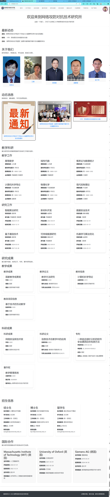

### 导航栏
#### 未登录
- logo：跳转到首页
- 首页：跳转到首页
- 关于我们：跳转到关于我们页面
- 教学科研：跳转到教学科研页面
- 研究成果：跳转到研究成果页面
- 招生信息：跳转到招生信息页面
- 国际合作：跳转到国际合作页面
- 头像：跳转到登录页面

#### 已登录
- logo：跳转到首页
- 首页：跳转到首页
- 关于我们：跳转到关于我们页面
- 教学科研：跳转到教学科研页面
- 研究成果：跳转到研究成果页面
- 招生信息：跳转到招生信息页面
- 国际合作：跳转到国际合作页面
- 内部管理：跳转到内部管理页面
- 下载专区：跳转到下载专区页面
- 用户帮助：跳转到用户帮助页面
- 头像：出现下拉菜单，可以选择退出登录，也可以跳转到个人中心页面

### 页脚
- 版权信息：显示版权信息
- 计算机学院：跳转到计算机学院官网
- 研究生院：跳转到研究生院官网
- 研究生管理系统：跳转到研究生管理系统官网

### 关于我们
- 简介：显示研究所简介
- 师资队伍：表格形式显示教师信息
- 学生信息：照片墙形式显示所有学生，点击弹出模态框显示学生信息
- 联系我们：显示联系方式
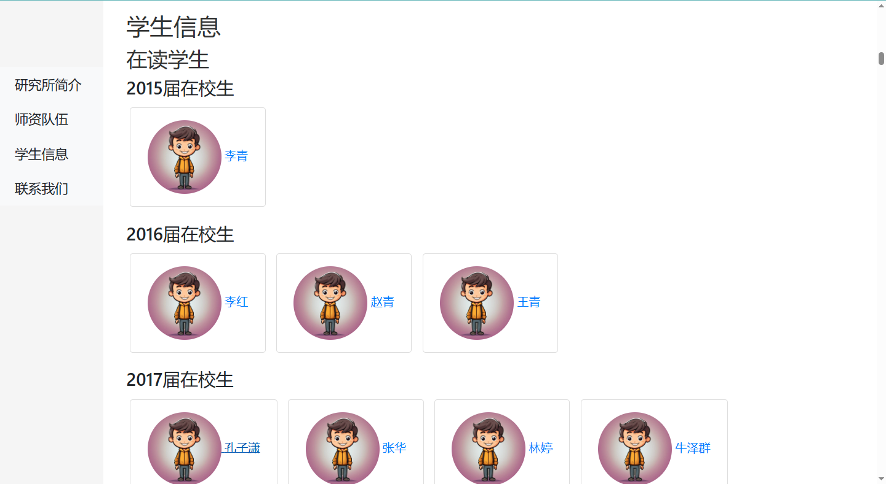
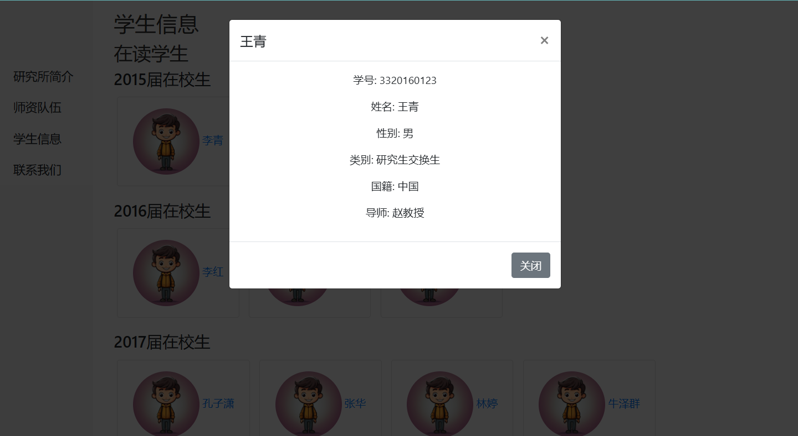

### 动态消息

#### 有编辑权限用户登录
- 新闻：显示新闻的封面照片墙，点击跳转到新闻详情页面，可以编辑新闻
- 通知：显示通知的封面照片墙，点击跳转到通知详情页面，可以编辑通知
- 活动：显示活动的封面照片墙，点击跳转到活动详情页面，可以编辑活动
- 发表文章：跳转到文章编辑页面，可以发表文章
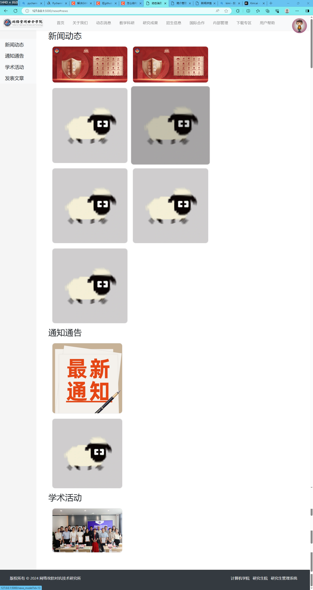
#### 未登录和无编辑权限用户登录
- 新闻：显示新闻的封面照片墙，点击跳转到新闻详情页面
- 通知：显示通知的封面照片墙，点击跳转到通知详情页面
- 活动：显示活动的封面照片墙，点击跳转到活动详情页面

#### 新闻详情页面
- 文章发布页面允许用户直接放置外部链接，可以直接跳转到外部链接
- 标题：显示新闻标题
- 作者：显示新闻作者
- 发布时间：显示新闻发布时间
- 附件列表：显示新闻附件列表，点击下载附件
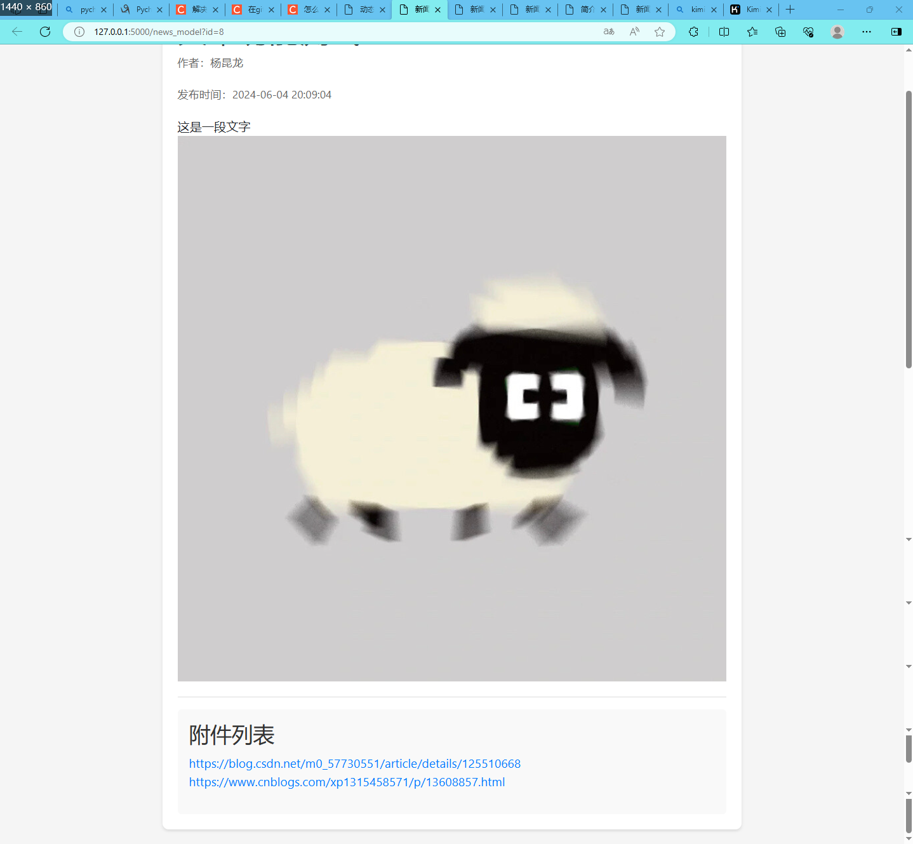

#### 文章发布页面
- 标题：选择文章类型，默认为新闻
- 标题：输入新闻标题
- 撰稿人：输入文章作者
- 内容：输入文章内容
- 输入外部链接：如果要发布的文章在外部网站，可以输入外部链接，点击发布按钮，即可发布文章
- 插入图片：点击按钮，弹出模态框，选择图片，点击确定，即在文章中插入图片
- 插入封面：点击按钮，弹出模态框，选择图片，点击确定，即可在插入封面
- 附件：点击按钮，弹出模态框，选择文件，点击确定，即可在文章中插入附件
- 输入附件链接：如果要发布的文章在网站外，可以输入外部链接，中间用逗号隔开
- 提交：点击发布按钮，即可发布文章
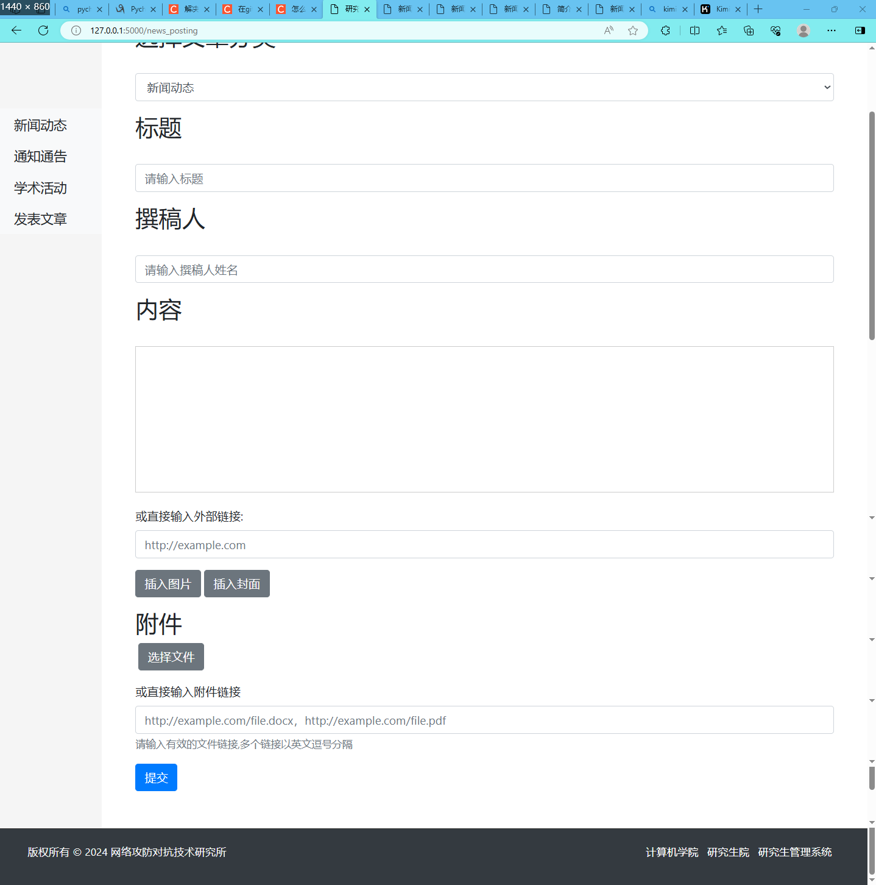

### 教学研究页面
- 教学工作：显示所有教学工作的基本信息
- 科研工作：显示所有科研工作的基本信息
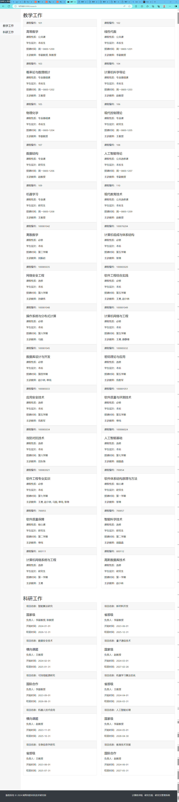

### 研究成果页面
- 教学成果：下有四个模块，分别显示教学成果，教学论文，教材信息，教改项目信息
  - 教学成果：表格形式显示所有教学成果的基本信息
  - 教材信息：表格形式显示所有教材信息的基本信息
  - 教改项目信息：表格形式显示所有教改项目信息的基本信息
  - 教学论文：表格形式显示所有教学论文的基本信息
- 科研成果：下有四个模块，分别显示科研成果，科研论文，专利，著作权信息
     - 科研成果：表格形式显示所有科研成果的基本信息
     - 科研论文：表格形式显示所有科研论文的基本信息
     - 专利：表格形式显示所有专利的基本信息
     - 著作权信息：表格形式显示所有著作权信息的基本信息
- 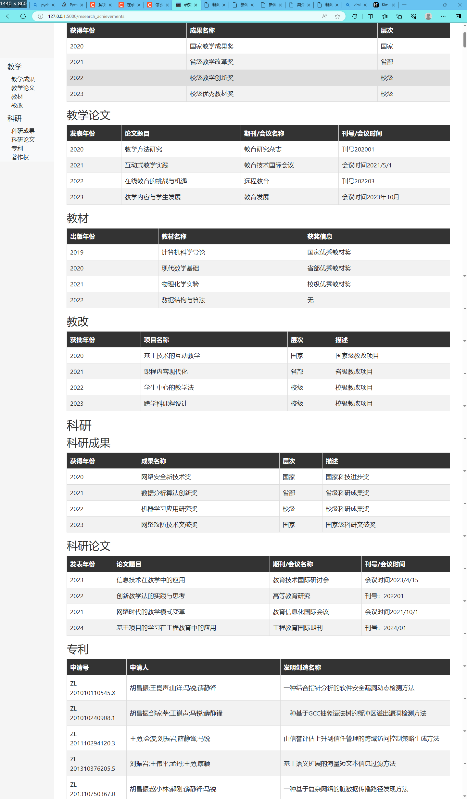

### 招生信息页面
- 本科生信息：表格形式显示所有本科生招生信息
- 硕士生信息：表格形式显示所有硕士生招生信息
- 博士生信息：表格形式显示所有博士生招生信息
- 留学生信息：表格形式显示所有留学生招生信息
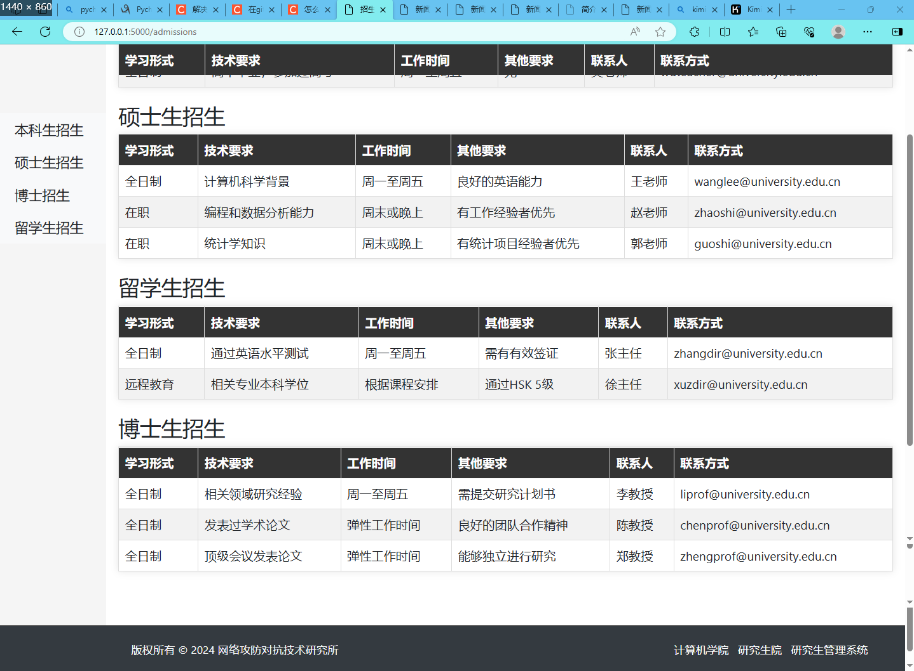

### 国际合作页面
- 表格形式显示所有国际合作项目的基本信息
- 包括合作的大学/企业名称，所属国家，合作项目，开始时间，结束时间，状态，描述
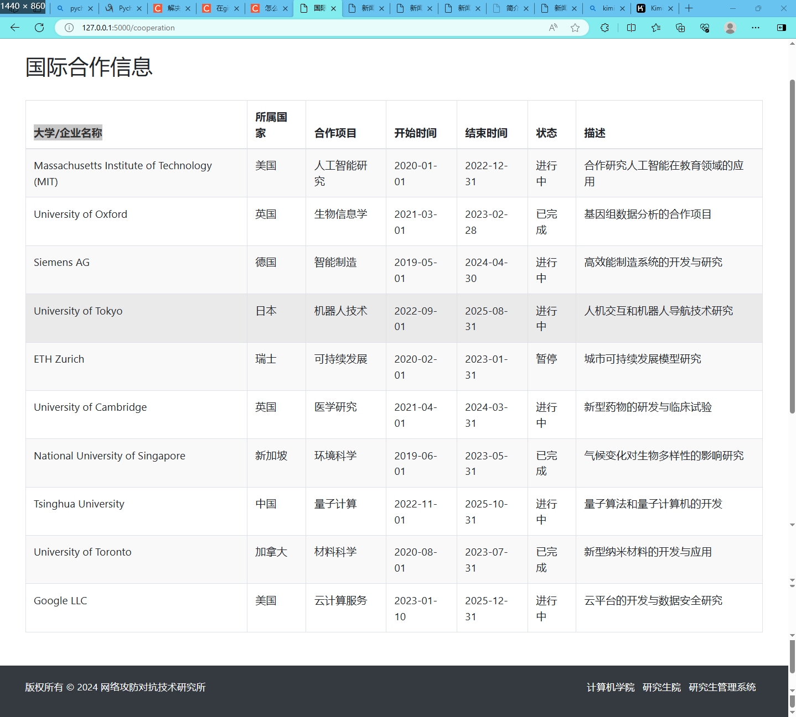

### 内部管理页面

#### 普通用户登录内部管理页面
- 通知通告：跳转动态消息页面
- 图书借阅：跳转到图书借阅页面

#### 图书管理员登录内部管理页面
- 申请处理：跳转到申请处理页面，可以处理图书借阅申请

#### 全职教师或所长登录内部管理页面
- 统计分析：跳转到统计分析页面，老师查看自己名下的学生的登录情况；所长可以查看所有用户的登录情况

#### 有简介更新权限用户登录内部管理页面
- 简介管理：跳转到简介更新页面，可以更新简介

#### 超级管理员登录内部管理页面
- 超级管理员有以上所有权限
- 系统设置；跳转到系统设置页面，可以设置系统参数，包括图书借阅常量和用户权限更改
- 批量导入数据：跳转到批量导入数据页面，可以批量导入数据
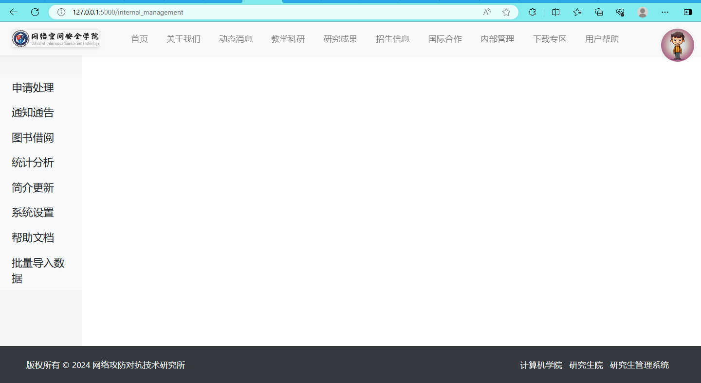

#### 图书借阅页面
- 图书列表：显示所有图书的基本信息，点击图书名称可以查看图书详情
- 搜索框：输入图书名称，作者或者id，可以搜索图书
- 申请借阅：点击按钮，弹出模态框，填入申请理由，点击确定，即可申请借阅，等待审批
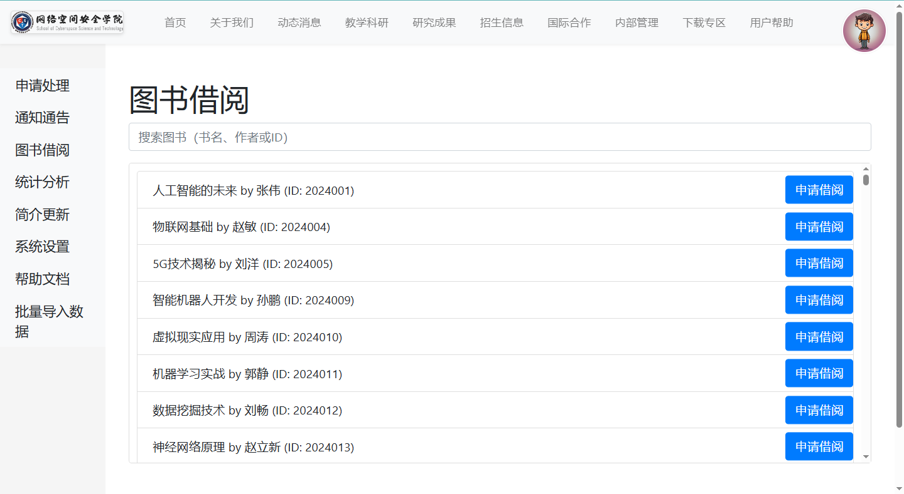
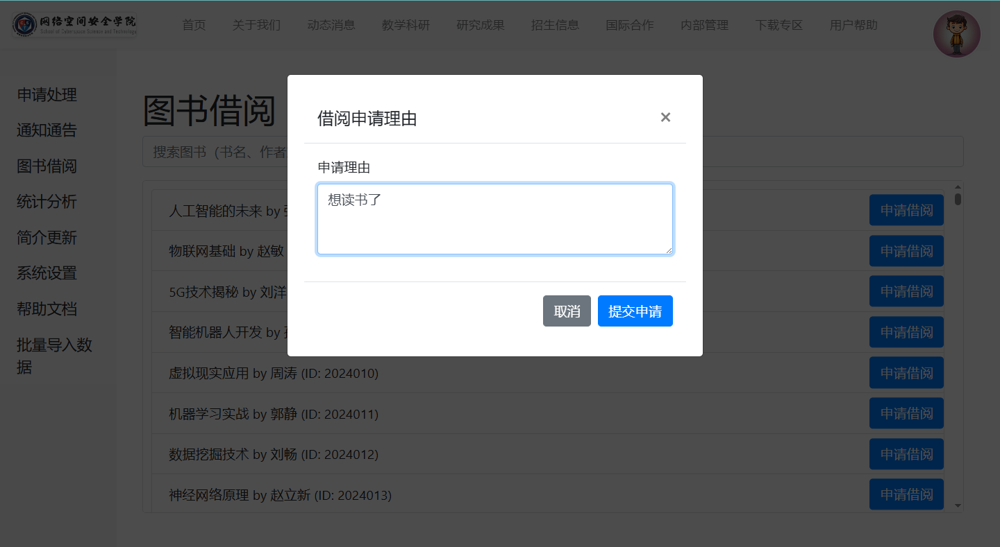

#### 申请处理页面
- 待处理申请：显示所有待处理的申请
- 同意申请：点击按钮，弹出模态框，输入处理备注，点击确定，即可同意申请
- 拒绝申请：点击按钮，弹出模态框，输入处理备注，点击确定，即可拒绝申请
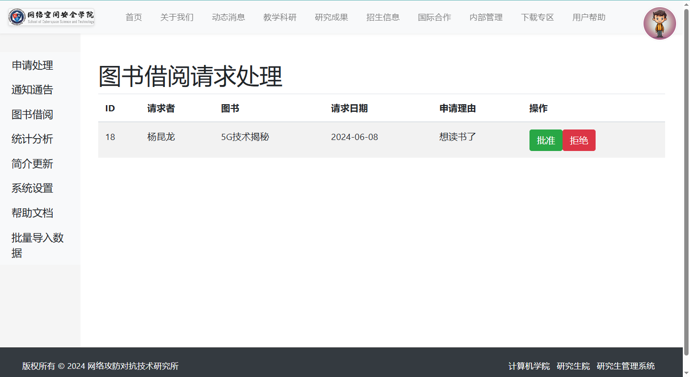

#### 统计分析页面
- 该页面只有全职教师和所长可以访问
- 登录情况：显示所有用户的登录情况，包括登录时间，登录IP，登出时间，导师工号，副导师工号，用户工号
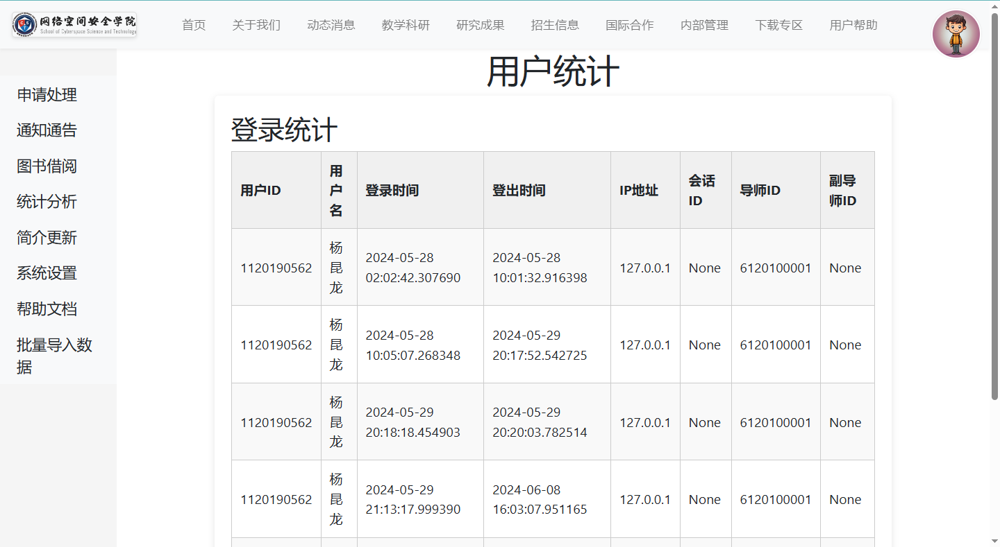

#### 简介更新页面
- 该页面只有有简介更新权限的用户可以访问
- 展示所有研究所简介：包括名称，简称，地址，电话，传真，邮箱，网站，logo，创建时间，是否启用，更新者姓名
- 停用：点击按钮，可以停用简介，停用后，该简介将不再显示
- 启用：点击按钮，可以启用简介，启用后，该简介将再次显示，同一时间只能有一个简介被启用，否者会提示用户
- 新增：点击按钮，弹出模态框，填写简介信息，点击确定，即可新增简介，新增后，该简介将保存到数据库中
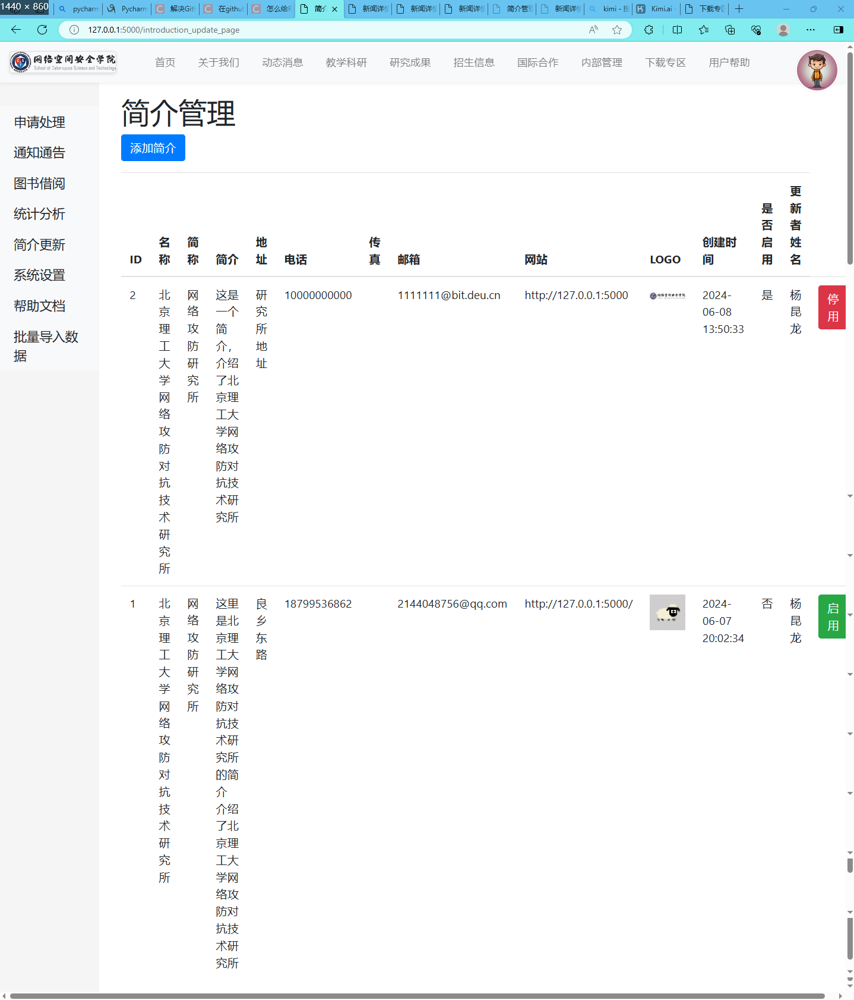
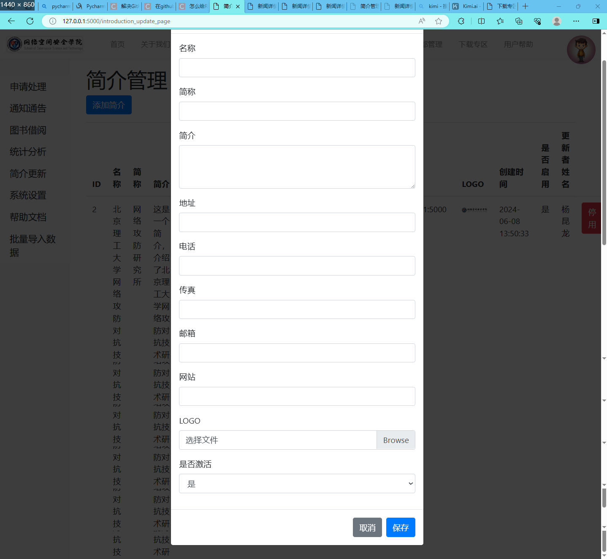

#### 系统设置页面
- 该页面只有超级管理员可以访问
- 图书借阅常量：显示所有用户的图书借阅常量，包括间隔日期，借阅期限，逾期提醒天数，节约上限，违规次数上限
- 用户权限更改：显示所有用户的用户权限
- 修改：点击按钮，弹出模态框，修改图书借阅常量和用户权限，点击确定，即可修改
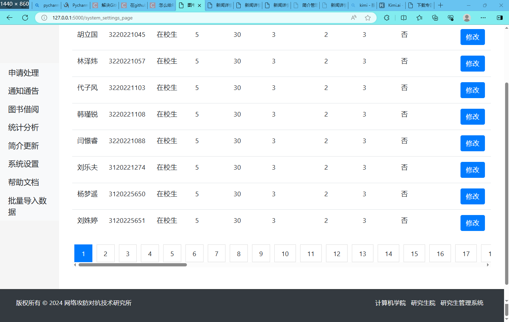
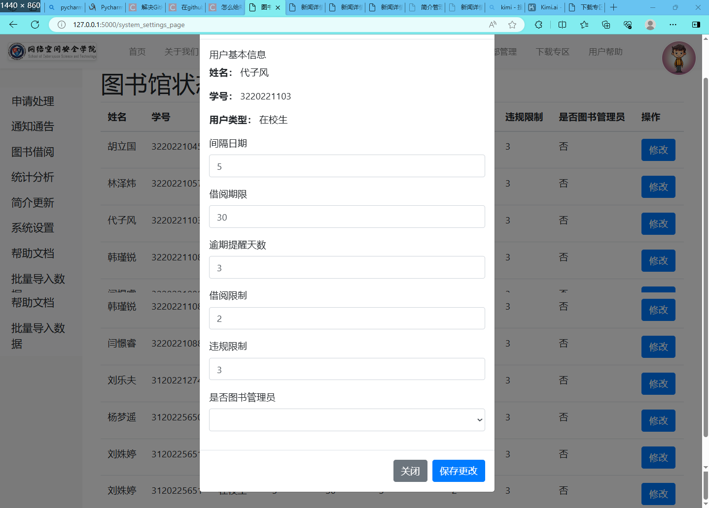

#### 批量导入数据页面
- 该页面只有超级管理员可以访问
- 导入的文件模板在下载专区页面下载
- 选择文件：弹出文件选择框，选择要导入的文件
- 选择文件类型：选择文件类型，包括在校生信息，毕业生信息，教师信息，科研工作信息，教学工作信息，教学成果，教学论文，教材，教改，科研成果，科研论文，专利，著作权信息，招生信息，国籍合作信息，图书信息
- 批量导入：点击按钮，导入文件，导入成功后，会显示导入成功信息
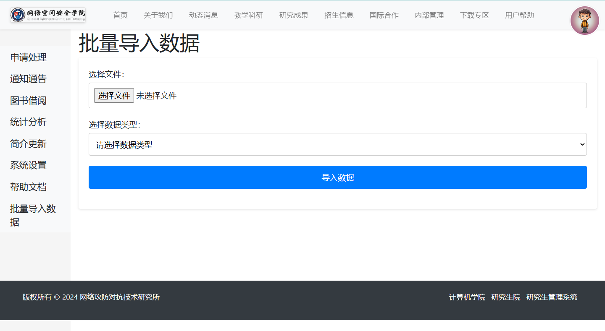

### 下载专区页面
- 该页面需要登陆后才能访问
- 下载主页：导航至下载主页
- 文件下载：点击导航至对应类别的下载页面，可以下载相应的文档
- 资料上传：点击按钮，导=导航至资料上传页面，可以上传文件，点击确定，即可上传文件，上传成功后，会显示上传成功信息
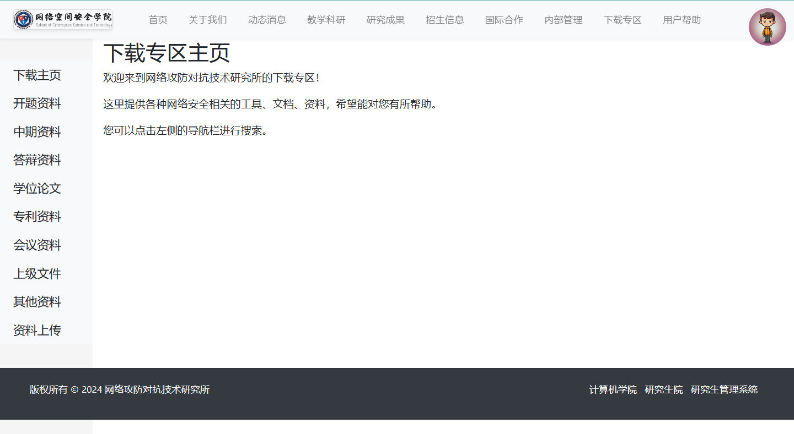

#### 资料上传页面
- 输入资料标题，作者，简介，资料类型，选择文件
- 点击确定，即可上传文件，上传成功后，会显示上传成功信息
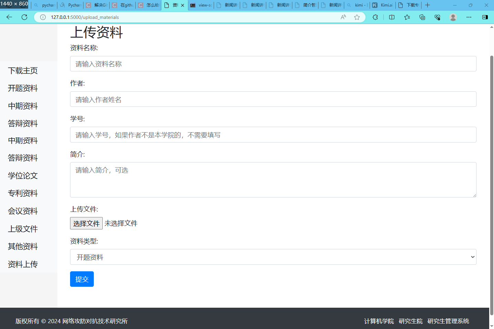

#### 文件下载页面
- 点击相应的类别，跳转至对应类别的下载页面
- 下载文件：点击按钮，下载文件，下载成功后，会显示下载成功信息
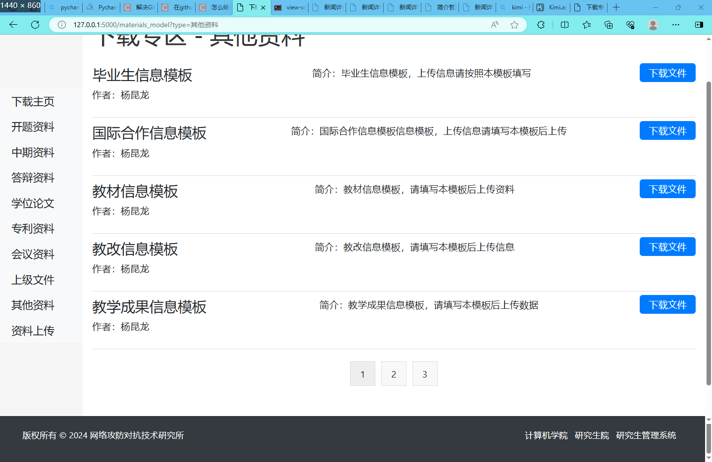

### 用户帮助页面
- 用户手册：显示用户手册
- 索引查询：显示索引查询
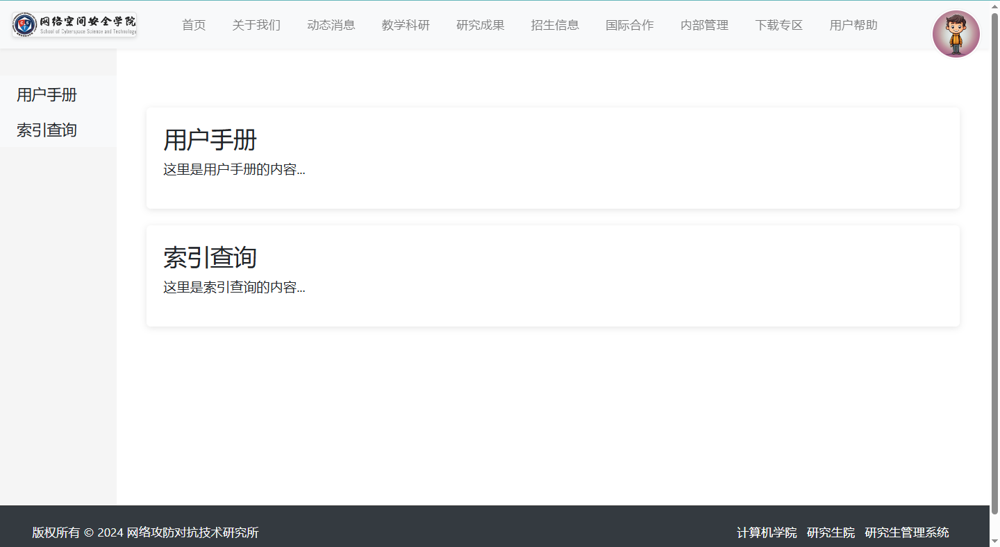

### 用户登录页面
- 输入用户名和密码，点击登录按钮，即可登录
- 未激活：未激活的用户，需要激活后才能登录，跳转至激活页面
- 密码错误：密码错误，会显示密码错误信息
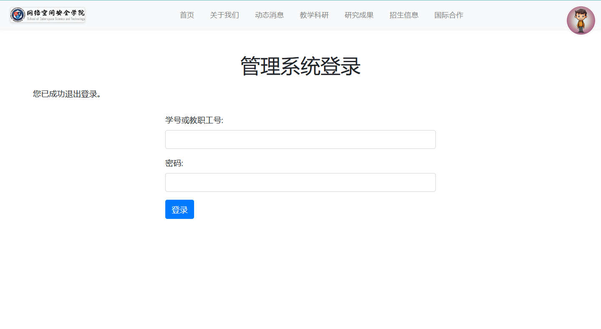

### 用户激活页面
- 本系统是内部系统，不设置注册页面，由超级用户导入用户，用户需要激活后才能登录
- 激活码发送至bit邮箱
- 输入激活码，点击激活按钮，即可激活
- 激活成功：激活成功，自动登录，跳转至主页
- 激活失败：激活失败，会显示激活失败信息
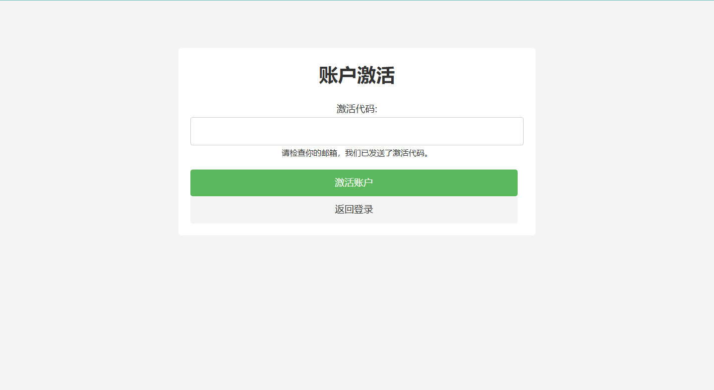

### 个人主页
- 显示用户基本信息
- 显示用户头像
- 借阅的书籍：显示用户借阅的书籍信息
- 修改信息：点击按钮，输入新值，点击确定，即可修改信息
- 修改密码：点击按钮，输入新密码，点击确定，即可修改密码
- 修改头像：点击按钮，选择图片，点击确定，即可修改头像
- 还书申请：点击按钮，弹出模态框，输入申请理由，点击确定，即可申请还书，等待审批
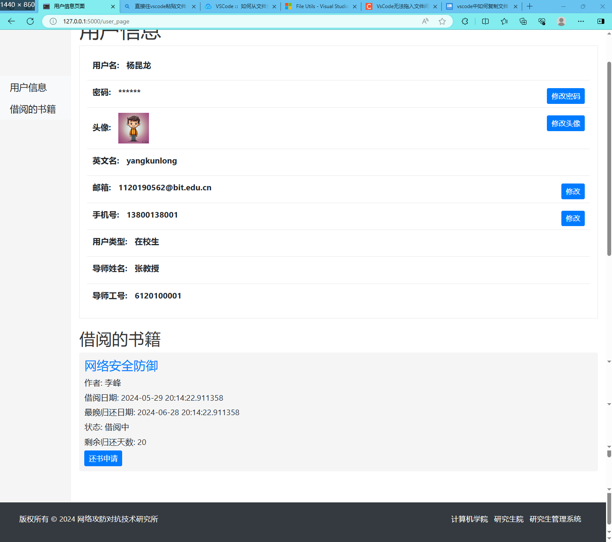

## 其他未展示功能
- 由于某些限制，以下功能无法展示，但是本项目已经按照框架实现
- 借阅逾期提醒，在借阅预期前两天（这个值可在系统设置中修改）时，在用户登录时会提醒用户有逾期的书籍
- 借阅上限提醒，在用户在借书籍达到借阅上限（这个值可在系统设置中修改）时，提醒用户借阅上限已满
- 借阅间隔提醒，在用户借阅同一本书籍距其返还该书不超过借阅间隔（这个值可在系统设置中修改）时，提醒用户借阅间隔未到
- 违规提醒，在用户违规次数达到违规次数上限（这个值可在系统设置中修改）时，提醒用户违规次数已满，不再提供借阅服务
